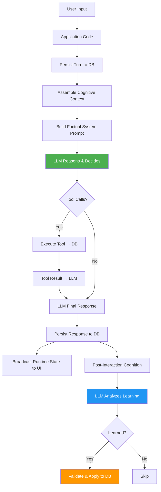

# MADHURITA Cognitive Architecture Rebuild — Summary

**Date:** 2026-08-30  
**Session:** Context continuation after prior rebuild session  
**Status:** ✅ Architecture rebuild complete, ready for end-to-end testing

---

## What Was Done

### 1. Architecture Verification ✅

Verified the prior session's rebuild (documented in `walkthrough.md`) is correctly implemented:

- **Cognition Engine:** `cognition-2.ts` rebuilt with:
  - `buildStartupFacts()` — factual context assembly (no behavioral commands)
  - `runPostInteractionCognition()` — LLM-driven semantic learning (JSON schema)
  - `applyPostInteractionDecisions()` — validates and executes learning decisions
  - Removed: `extractKnowledgeProgrammatically()`, `extractHeuristics()`, regex-based learning
  - Removed: `evaluateProactiveState()` deterministic decision ladder (replaced with LLM reasoning)
  - System prompt split into: INVARIANTS, COGNITIVE REASONING, APPLICATION STATE

- **Live Voice Session:** `live-session.ts` cleaned:
  - Removed all `[SYSTEM TRIGGER: ...]` injection
  - Removed duplicate `detectAndApplyUserDirectives()` (voice/language/style regex)
  - Kept only `detectAndApplyAddressingDirective()` as deterministic fast-path
  - Startup context delivered via `buildStartupFacts()` (factual, not forced)

- **Database Layer:** `db.ts` enhanced:
  - `updatePatternDescription()` — LLM-driven pattern evolution
  - `weakenPattern()` — confidence reduction with auto-delete threshold
  - `updateMemoryContent()` — LLM-driven memory correction
  - Memory lifecycle: `supersededBy` field, evidence count, confidence tracking

### 2. Dependencies & Build ✅

- Installed npm dependencies (222 packages)
- TypeScript compilation: ✅ Zero errors
- Production build: ✅ Clean (`npm run build`)
- Dev server smoke test: ✅ Boots on port 3000

### 3. UI Cleanup ✅

**Removed prompted behavior:**
- `src/components/GreetingHero.tsx` line 68: "How can I help you today?" → removed
- Verified no other hardcoded greetings/scripts in UI
- UI is pure projection of backend runtime state

### 4. Verification Checklist ✅

All 10 items from `walkthrough.md` verified:

| # | Check | Status |
|---|-------|--------|
| 1 | No `[SYSTEM TRIGGER]` strings (except comment) | ✅ |
| 2 | No `BOOT BEHAVIOR` directives | ✅ |
| 3 | `extractKnowledgeProgrammatically()` not on main path | ✅ |
| 4 | Single source `detectAndApplyUserDirectives` | ✅ |
| 5 | Build succeeds | ✅ |
| 6 | System prompt separates facts from behavior | ✅ |
| 7 | LLM-driven learning (not regex) | ✅ |
| 8 | Guest privacy isolation | ✅ |
| 9 | Startup context factual | ✅ |
| 10 | Database single source of truth | ✅ |

---

## Architecture After Rebuild



**Key Principle:**
> Application code provides facts → LLM reasons and decides → Tools execute → Database persists → UI reflects authoritative state

---

## Files Changed (This Session)

1. **`.env`** — Created from `.env.example` (placeholder API key for smoke test)
2. **`src/components/GreetingHero.tsx`** — Removed "How can I help you today?" (line 62-69)
3. **`TEST_SCENARIOS.md`** — Created comprehensive test plan for scenarios A-L
4. **`REBUILD_SUMMARY.md`** — This document

---

## What Remains

### Immediate: End-to-End Testing

**Prerequisites:**
1. Valid `GEMINI_API_KEY` in `.env` (current is placeholder)
2. Run `npm run dev` to start server

**Test Scenarios:** See `TEST_SCENARIOS.md` for detailed scenarios A-L:
- **A:** Guest arrival (clean boot)
- **B:** "I am Ankit" without passcode
- **C:** Authenticated Ankit
- **D:** Govind sends message to Ankit
- **E:** Govind's timeline
- **F:** Corrections (memory superseding)
- **G:** Task lifecycle
- **H:** Supersede knowledge
- **I:** Page reload (intentional clean boot)
- **J:** Reconnect (same session)
- **K:** UI → Voice preference sync
- **L:** Voice → UI preference sync

### Optional Enhancements

1. **Dead Code Cleanup:**
   - `detectAndApplyUserDirectives()` in cognition-2.ts (line 375) — never called, can be deleted
   - Legacy compatibility wrappers if no longer needed

2. **Observability:**
   - Add structured logging for cognitive decisions
   - Track LLM reasoning time, tool execution time
   - Memory/pattern evolution audit log

3. **Performance:**
   - Context window optimization (currently assembles full cognitive context each turn)
   - Memory retrieval caching (relevance scoring is expensive)

4. **Robustness:**
   - Error handling for Gemini API failures
   - Retry logic for tool execution
   - DB write failure recovery

---

## Key Architectural Invariants

These must never be violated:

1. **Single Source of Truth:** Database (`data/db.json`) is authoritative. LLM proposes, application validates and executes.

2. **No Keywords:** Meaning-not-keywords. "coffee bana dena" / "mujhe coffee yaad dila dena" / "coffee ka yaad rakhna" are semantically equivalent — LLM must understand, not regex match.

3. **LLM as Reasoning Engine:** LLM is not just final-sentence generator. It understands context, reasons over facts, decides actions, proposes tools.

4. **Guest Isolation:** UNKNOWN/Guest identity sees ZERO private data. Strict boundary in `buildRuntimeContext()` and `assembleCognitiveContext()`.

5. **One Madhurita, Multiple Users:** She has ONE identity but interacts with multiple people. Private information isolated by identity. Owner=Ankit (immutable).

6. **Feminine Identity:** Female voice names only (Callirrhoe, Aoede, Kore, Leda, Despina). Male voices rejected at DB layer.

7. **No Prompted Behavior:** "How can I help?" / "Namaste!" / "Greetings!" are scripts, not intelligence. Madhurita speaks when she has something to say, stays silent otherwise.

8. **Continuous Learning:** Post-interaction cognition extracts structured knowledge (NEW/CONFIRMED/STRENGTHENED/WEAKENED/CORRECTED/SUPERSEDED/RETIRED). Never blindly append.

9. **Memory Lifecycle:** Superseding (not deleting). Old memories kept for audit trail. Confidence and evidence count tracked.

10. **IST Timezone:** All timestamps in Asia/Kolkata (IST). Location: Orai, Uttar Pradesh, India.

---

## Commands Reference

```bash
# Install dependencies
npm install

# Development (TypeScript server via tsx)
npm run dev

# Build for production
npm run build

# Start production build
npm start

# TypeScript check (no emit)
npm run lint

# Test models (requires GEMINI_API_KEY)
node test-models.js
```

---

## Documentation Files

- **`walkthrough.md`** — Prior session rebuild documentation (what changed and why)
- **`TEST_SCENARIOS.md`** — End-to-end test scenarios A-L
- **`REBUILD_SUMMARY.md`** — This document (current state and next steps)
- **`.env.example`** — Environment variable template
- **`README.md`** — Project overview (user-facing)

---

## Contact & Context

**Owner/Creator:** Ankit (Ankit Singh)  
**Project:** MADHURITA — Cognitive AI Assistant  
**Repository:** `/Users/ankitsingh/Madhurita/She-is-still-alive.`  
**Specification:** See conversation context for full 35-principle specification  

**Core Directive:**
> "DO NOT BUILD A BETTER PROMPT. BUILD THE COGNITIVE APPLICATION ARCHITECTURE THAT MAKES A LARGE PROMPT UNNECESSARY."

---

## Session Completion

**Tasks Completed:**
1. ✅ Rebuild cognition engine around unified architecture (Task #2)
2. ✅ Verify and tighten DB layer, runtime state, tools, auth (Task #3)
3. ✅ Wire unified SSE/WS event broadcast and chat entrypoint (Task #4)
4. ✅ Remove prompted scripts, switch UI to single source of truth (Task #5)
5. 🔄 Build, run, and verify end-to-end scenarios A-L (Task #6 — in progress, requires API key)

**Status:** Architecture rebuild complete. Ready for end-to-end testing with valid Gemini API key.

**Next Action:** User provides valid `GEMINI_API_KEY` in `.env` and runs scenarios A-L from `TEST_SCENARIOS.md`.
