> **THIS BOOK IS THE INTENT, NOT THE INVENTORY.** It says what Madhurita is meant to be. It does not track what is finished — a book that tried to would be wrong within a day, and a stale "not implemented" banner on a specification that has been implemented is exactly the kind of false status this project does not tolerate anywhere else. Where the book and the tree disagree about *what exists*, the tree wins and the book is out of date. Where they disagree about *what is intended*, the book wins and the tree is a defect.

---

## 0. Reading Order & How To Use This Book

This book is split into **28 Parts**. It is intentionally comprehensive and detailed:

- **Architects** start at Parts I–VII (Foundations, Domain Model, Identity, Security, State, Events, Cognition).
- **Backend engineers** start at Parts VIII–XV (Memory, Retrieval, Actions, Tasks, Loops, Learning, Proactivity, Voice).
- **Frontend & realtime engineers** start at Parts XV–XVI (Voice, Realtime Flow) and Part XX (Advanced Intelligence). Parts XVII–XIX specified a visual direction that is withdrawn; there is no visual specification in this book any more.
- **Quality engineers** start at Parts XXIII–XXVII (Testing, Performance, Hardening, Rollout).
- **Future agents** read **Part XXVIII — Resume Protocol** first, then read only the parts the protocol points to.

Every Part ends with a **Verification** block. No Part is "done" until its Verification block passes.

### 0.1 Authoritative Document

If any other file (README, plan, design spec, chat message, older markdown) contradicts this Build Book about **what is intended**, this Build Book wins. The book is the single source of truth for Madhurita's design.

There is exactly one companion with standing of its own: **`docs/MADHURITA.md`**, the state document. It wins about **what exists** — paths, line counts, what runs without a key, what the gates report, what is unfinished — because that is the one thing this book deliberately does not track. The two are not rivals; they answer different questions, and each says so at its own head.

### 0.2 Implementation Prohibition (Discharged)

This section used to read: *"No code implementing Madhurita's new architecture may be written until the user explicitly approves this Build Book."* That approval was given and the rebuild has been carried out. The prohibition is **discharged** and kept here only so that its removal is a recorded act rather than a silent one.

What survives it is the rule underneath: **no code may contradict this book.** A change that departs from a specification here is not permitted to depart silently — it either changes the book (as the withdrawal of Parts XVII–XIX did) or it is a defect. The narrower prohibitions in **II.10** and **XXVIII.3** — never commit, never push without an explicit user command — are *not* discharged and never expire.

---

## I. THE PROBLEM (Why We Are Rebuilding)

### I.1 Symptom

The existing Madhurita codebase contains working infrastructure (LLM SDK calls, Web Audio capture, Gemini Live WebSocket, SQLite persistence) but the *application* layer around it has accreted ad-hoc — modules overlap, identity is implicit, memory is a free-form bag, and the cognitive loop is best-effort instead of guaranteed.

### I.2 Root Cause

There is **no single authoritative architecture.** The LLM is treated as the application. State lives in many places, none of which are strictly authoritative. Realtime is a side effect rather than a contract. The user is sometimes the owner, sometimes a guest, sometimes an unauthenticated peer — and the system cannot always tell which.

### I.3 The Cost

- **Unsafe disclosures**: knowledge the system *has* can leak to someone who *should not know it.*
- **Lost continuity**: context the user *did* share can vanish across sessions.
- **Unverifiable execution**: a textual "done" is treated as proof. It is not.
- **Cognitive collapse**: the system has no formal 12-stage loop, so "thinking" is a prompt, not a process.
- **Visual drift**: the interface is loosely themed rather than autonomously driven by authoritative state.

### I.4 The Fix

Rebuild Madhurita as a **persistent cognitive agent** with **one identity, one state, one cognition, one persistence, one action pipeline, one realtime flow, one event system, one learning system, and one proactive engine** — all under strict application authority, with the LLM as a reasoning *faculty* but never as the *application.*

---

## II. CORE PHILOSOPHY (The Non-Negotiables)

### II.1 Madhurita Is Not a Chatbot

Madhurita is a **persistent cognitive agent.** She has a continuous existence, a continuous identity, a continuous memory, and a continuous learning trajectory. A conversation is an *event* in her life, not the frame of her existence.

### II.2 The LLM Is a Faculty, Not the Application — LLM Decision vs Application Authority

The LLM performs **semantic reasoning** — interpreting user input, classifying intent, generating strategy, drafting language, extracting candidate memories, proposing proactive candidates, and proposing decisions. The LLM does **not** perform any of the following, ever, unilaterally:

- Identity authentication
- Authorization decisions
- State mutations
- Persistence writes
- Tool execution
- Event emission
- Realtime broadcasting
- Memory storage or retrieval
- Memory disclosure
- Loop management
- Proactivity *authorization*
- Task scheduling
- Verification of action outcomes

All of these are **application responsibilities**, governed by application code that is independently testable, deterministic, and authoritative. The LLM is one reasoning faculty inside the application — the LLM is **not the application**.

**The LLM decision authority model is a fixed ladder, applied everywhere:**

```
LLM DECISION PROPOSAL
        ↓
APPLICATION VALIDATION       (is the proposal well-formed? is it a kind the app recognizes?)
        ↓
APPLICATION AUTHORIZATION    (is the proposal permitted for this caller against this resource?)
        ↓
EXECUTION / RESPONSE / SILENCE
```

If the LLM proposes something invalid or unauthorized, the application **rejects it deterministically.** The LLM has no fallback path. There is no "well, the LLM really wanted to, so let's let it through." Rejection is rejection, with a reason recorded in the audit log.

This ladder applies to:

- **Cognitive Stage 4 (UNDERSTAND)**, **Stage 5 (REASON)**, and **Stage 6 (DECIDE)**: the LLM proposes an understanding, a reasoning trace, and a decision. The application validates that the decision is in the allowed decision set, and authorizes it against the caller's permissions before any state change.
- **Action Pipeline Stage 1 (UNDERSTAND)**, **Stage 2 (PLAN)**: the LLM may propose which tool to call and with what arguments. The application validates the proposal against the tool's Zod schema, and authorizes the call against the caller's permission set.
- **Proactive Engine**: the LLM may propose a proactive candidate. The application runs the deterministic decision tree (urgency, novelty, timing, interruption cost, user context, anti-spam, quiet hours) and authorizes or suppresses.
- **Learning Pipeline**: the LLM may propose memory extractions. The application validates the proposal against the multi-domain schema and the scoped learning policy (see XIII), and only then writes to memory.

### II.3 One Of Everything

| Concept | One Of |
| --- | --- |
| Identity | `Identity` (single object per agent) |
| Application state | `RuntimeState` (single authoritative live projection) |
| Durable state | `PersistenceLayer` (single authoritative durable source) |
| Cognitive runtime | `CognitiveRuntime` (single 12-stage cycle) |
| Persistence | `PersistenceLayer` (one transactional interface) |
| Event system | `EventBus` (one ordered, typed log) |
| Action pipeline | `ActionPipeline` (7 stages) |
| Realtime flow | `RealtimeFlow` (7 ordered stages) |
| Learning system | `LearningSystem` (one pipeline) |
| Proactive engine | `ProactiveEngine` (one decision loop) |

There is exactly one of each. There are no parallel or competing instances. Split-brain state is forbidden (see VI.5).

### II.4 Security Boundary — Knowledge Possession, Retrieval, Disclosure

Madhurita is one agent with one memory. She may internally *possess* knowledge about multiple identities, about people, about facts the owner has not authorized any other person to see. The caller's identity **does not** define what knowledge Madhurita possesses. The caller's identity defines what Madhurita is permitted to *retrieve* and what Madhurita is permitted to *disclose* to them.

The boundary has four distinct layers, applied in order:

1. **Knowledge Possession** — what is currently stored in the durable state, regardless of who is present. Possession is the agent's own; it is not gated by caller.
2. **Knowledge Retrieval Policy** — a deterministic, application-defined policy that decides which subset of possessed knowledge may be *loaded into the cognitive working context* for a given caller. The policy is identity-scoped, domain-scoped, sensitivity-scoped, and provenance-scoped. Retrieval is not the same as disclosure.
3. **Caller-Scoped Working Context** — the actual items loaded into the current cycle's working memory. This is what stage 3 (RECALL) operates on, and what stages 4–9 may see.
4. **Knowledge Disclosure Policy** — a deterministic policy that decides which items in the working context may be *rendered, spoken, or otherwise surfaced* to the current caller. Disclosure is the only step that produces user-visible output. Authorization happens *before* disclosure, not after.

A caller may not gain access to a fact merely because the fact exists in Madhurita's memory. There is no "possession implies disclosure" path. There is no "possession implies retrieval" path. There is no "retrieval implies disclosure" path. Each step is a separate gate.

Madhurita is one agent with one identity and one cognitive runtime. The owner sees what the owner is authorized to see. A known person sees what the person is authorized to see. A guest sees what the system deems safe-by-default. None of these three views are separate "brains" — they are three different *retrieval and disclosure policies* applied to the same single memory.

### II.5 Action Is Proven, Not Claimed

A textual "done" is not proof. Every action goes through:

```
UNDERSTAND → PLAN → AUTHORIZE → EXECUTE → VERIFY → PERSIST → RESPOND
```

- `UNDERSTAND` and `PLAN` are LLM-proposable but the proposal is **validated** by the application against tool schemas and **authorized** against the caller's permissions before EXECUTE.
- `EXECUTE` calls the underlying system with deadlines, retries, and isolation.
- `VERIFY` re-reads authoritative state and asserts the preconditions are now postconditions. A textual claim from the tool is not sufficient.
- `PERSIST` is the only writer to durable state, and is itself a transaction.
- `RESPOND` is the only place user-facing language is generated, and the language is generated by the LLM with **disclosure policy** applied.

**"Not proven" is two states, not one.** An `ActionResult` answers three questions and they are genuinely three: `attempted` — was the call dispatched at all; `success` — did it return; `verified` — did a re-read of authoritative state find the world changed. Only stage 8 may set the third, and this section is mostly about that. But the first is a safety distinction of its own: `attempted: true, success: false` means *the tool ran and did not finish, so the world may be half-changed — go and look*, while `attempted: false` means nothing was touched and nothing can have half-happened. Reporting both as one failure made her answer a capability that is simply switched off with "I started on that, but I could not confirm it actually went through" — a false claim about her own behaviour, and the more alarming of the two sentences. Stage 7 refuses before dispatch for four reasons (no clearance, no `toolId`, no authenticated identity, no executor wired), and every one of them is `attempted: false`.

### II.6 Realtime Is a Contract

Every state change in Madhurita flows through:

```
MUTATION → PERSISTENCE → DOMAIN EVENT → RUNTIME UPDATE → UI UPDATE → VOICE UPDATE → COGNITIVE UPDATE
```

No mutation may skip a stage. The contract is the contract.

### II.7 Restraint In The Interface

This non-negotiable used to be **"Photographic, Not Illustrated"** and it required the opposite of what it now requires: real WebGL, real shaders, real audio-driven geometry, and a ban on vector art anywhere but small icons. It is **withdrawn** along with Parts XVII–XIX; the reasoning is in **XVII.2**.

What replaces it is a demand that is harder to satisfy and cheaper to run: **the interface earns its polish by restraint, not by expense.** Ultra-smooth and highly optimised. Luxury, never cheap. Clean, subtle, minimal, and deliberately *not* UI-heavy. Original — not a copy of any existing product's look. A light signature sound, used sparingly.

The test of this rule is subtraction: if an element can be removed and nothing is harder to understand, it should not have been drawn. A dropped frame is a worse defect than a plain surface.

### II.8 No Mocks for Working Functionality — Real Infrastructure Adapters, Not Legacy Imports

Where real infrastructure is provably working (LLM provider SDK, Gemini Live WebSocket, Web Audio capture/playback, TTS, persistence), the new architecture **interfaces with the real system through a clean adapter** the new architecture owns. A mock is only allowed when the underlying system is provably unavailable, and only with a clearly-marked `// TODO: replace with real adapter` boundary.

Critically, this is **not** permission to import legacy modules into the new architecture. The new architecture owns its adapters. Legacy modules may be inspected as a reference for what the adapter needs to do, but the adapter itself is new code in the new architecture, and the architecture must rebuild correctly with the adapter (and not the legacy module) at runtime.

### II.9 Autonomous Visual State

Colour, light and motion are **derived from authoritative backend state** — time-of-day, weather, voice state, cognitive state. They are not hand-tuned per screen, and no component holds a palette of its own. The backend is the source; the frontend renders the source faithfully. The UI is never authoritative; the UI is always a projection of authoritative state.

This survived the withdrawal of the visual direction unchanged, because it was never about how the interface looked — it is about who is allowed to decide.

### II.10 No GitHub Operations Without Explicit User Command

The agent **must not** commit, push, open a PR, or create a branch unless the user explicitly says so. This is a hard rule. Working locally is permitted; shipping is not.

### II.11 Application Authority Over LLM Authority — Summary

| Concern | Authority |
| --- | --- |
| Identity authentication | Application |
| Authorization decisions | Application |
| State mutation | Application (LLM may propose) |
| Persistence writes | Application (only the persistence layer) |
| Tool execution | Application (LLM may propose the call) |
| Verification of action outcome | Application |
| Event emission | Application (one ordered, typed log) |
| Realtime broadcasting | Application (7-stage contract) |
| Memory storage | Application (LLM may propose extractions) |
| Memory retrieval policy | Application (LLM never chooses what to retrieve) |
| Memory disclosure policy | Application (LLM never chooses what to disclose) |
| Loop evaluation | Application |
| Proactivity authorization | Application (LLM may propose candidates) |
| Task scheduling | Application |
| Cycle orchestration | Application (LLM is invoked inside stages 4, 5, 6, 9 only) |

The LLM is **always a faculty.** The application is **always the authority.**

---

## III. SYSTEM CONTEXT

### III.1 Actors

| Actor | Description | Authority |
| --- | --- | --- |
| **Owner** | The single human who created this Madhurita instance. | Full authority over their own data, persona, and preferences. |
| **Known Persons** | People the owner has explicitly enrolled (name + relationship + permissions). | Read/access only what the owner has authorized for them. |
| **Guest** | An unauthenticated visitor (e.g. someone she is shown to). | Zero authority. Sees only what the system deems safe-by-default. |
| **Madhurita** | The agent herself. | Authority over her own state, memory, and reasoning. |
| **System** | The host application, runtime, and infrastructure. | Authority over identity, authorization, persistence, and execution. |

### III.2 Channels

| Channel | Direction | Latency Target | Protocol |
| --- | --- | --- | --- |
| **Text** | Owner ↔ Madhurita | <300ms keystroke echo | WebSocket / SSE |
| **Voice (live)** | Owner ↔ Madhurita | <200ms audio round-trip | Gemini Live WebSocket |
| **Voice (TTS)** | Madhurita → Owner | <250ms first byte | Backend TTS → AudioStreamer |
| **Realtime state** | Server → Clients | <150ms mutation → UI | SSE / WebSocket fan-out |
| **Background tasks** | Madhurita → System | n/a | Internal async queue |
| **Owner commands** | Owner → System | <500ms ack | HTTP + WebSocket |

### III.3 Environments

| Environment | Purpose | Data |
| --- | --- | --- |
| **Local dev** | Implementation, debugging, manual verification | Fresh DB per clone |
| **Staging** | Integration tests, pre-prod soak | Seeded realistic data |
| **Production** | Owner's daily use | Real owner data, backed up |

---

## IV. ARCHITECTURE (The One Picture)

### IV.1 Layered Topology

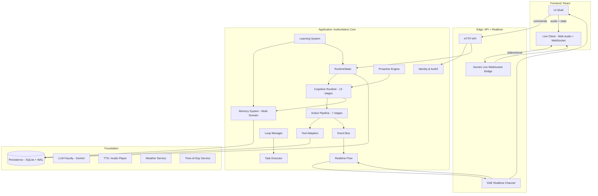

### IV.2 Authority Direction

The frontend **requests.** The application **decides.** The persistence **records.** The realtime **broadcasts.** The frontend **renders.** The cognitive runtime **reflects.** This direction is non-negotiable.

### IV.3 What Runs Where

| Layer | Process | Restartable Independently | State |
| --- | --- | --- | --- |
| **Frontend** | Browser | Yes (page reload) | Stateless except cache |
| **Edge API** | Node process | Yes | Stateless except SSE subscribers |
| **Application Core** | Node process | Yes (in-memory runtime) | Authoritative |
| **Persistence** | SQLite (embedded) | With application | Authoritative |
| **Realtime Fanout** | In-process pub/sub | With edge | Ephemeral |
| **LLM Faculty** | External (Gemini) | Provider-controlled | Provider |

---

## V. IDENTITY & AUTHENTICATION

### V.1 Identity Object

```ts
interface Identity {
  id: string;                  // stable ULID
  kind: 'owner' | 'person' | 'guest';
  displayName: string;
  preferredName?: string;
  relationshipToOwner?: 'self' | 'spouse' | 'child' | 'parent' | 'friend' | 'colleague' | 'other';
  permissions: PermissionSet;
  enrolledAt: number;
  lastSeenAt: number;
  status: 'active' | 'dormant' | 'revoked';
}
```

### V.2 Permission Set

```ts
interface PermissionSet {
  mayReadMemories: boolean;
  mayReadConversations: boolean;
  mayTriggerActions: 'none' | 'safe' | 'all';
  mayEnrollNewKnowledge: boolean;
  mayMutatePreferences: boolean;
  mayAccessTools: ToolId[];
  mayBeHeardInVoice: boolean;
  mayReceiveProactiveMessages: boolean;
}
```

### V.3 Authentication

| Mode | Mechanism | Lifetime |
| --- | --- | --- |
| **Owner bootstrap** | First-run setup (passphrase + recovery code) | Single-use bootstrap, then replaces with session |
| **Owner session** | Passphrase → KDF → key → session token (signed) | 12h sliding, refresh on activity |
| **Person session** | Owner-initiated enrollment → person-local PIN | 30 days, revocable |
| **Guest** | No credentials, ephemeral session id | 30 minutes, read-only safe mode |

### V.4 Authorization

Every action — read, write, execute, broadcast — passes through `authz.check(caller, action, resource)`. The function is pure, deterministic, and side-effect-free. The result is logged to the event bus.

### V.5 Bootstrap Invariant

The first time a Madhurita instance starts, there is **no owner.** The first human to interact becomes the owner via a deterministic bootstrap ceremony. No other path to ownership exists. There is exactly one owner per instance.

---

## VI. STATE

### VI.1 State Architecture — Durable State, Runtime State, Realtime Projection

The state architecture has exactly **one authoritative durable source** and **one authoritative live projection**:

```
SQLite / Persistence (Authoritative Durable Source of Truth)
        ↓
Application Memory (Authoritative Durable State - in-process)
        ↓
RuntimeState (Authoritative Live Projection - single instance per identity)
        ↓
Realtime Projection (broadcast via 7-stage Realtime Flow)
        ↓
UI / Voice Clients (render the projection)
```

- **SQLite / Persistence** is the **only** durable source of truth. It survives process restarts. It is never bypassed.
- **Application Memory** is the in-process authoritative state held by the application core. It is reconstructed from the durable source on startup and updated by transactions.
- **RuntimeState** is the single authoritative live projection. There is exactly one `RuntimeState` per identity. It is the only state the cognitive runtime reads from. It is the only state the realtime flow broadcasts.
- **Realtime Projection** is the broadcast of `RuntimeState` changes to connected clients via the 7-stage realtime contract (Part XVI).
- **UI / Voice** are never authoritative. They render what the realtime projection delivers. The LLM is never authoritative.

There is no parallel state store. There is no "UI state" that competes with RuntimeState. There is no "session state" that diverges. Split-brain state is forbidden.

### VI.2 RuntimeState — The One Live Projection

```ts
interface RuntimeState {
  version: number;                // schema version, monotonic
  identity: Identity;
  presence: PresenceState;
  environment: EnvironmentState;
  cognitive: CognitiveState;
  voice: VoiceState;
  memory: MemorySummary;
  loops: LoopSummary;
  tasks: TaskSummary;
  lastMutation: MutationRecord;
}
```

`RuntimeState` is the single authoritative live projection. Every other component reads from it. Only the application runtime mutates it. Every mutation goes through the realtime flow contract.

### VI.3 Sub-States

```ts
interface PresenceState {
  activeActor: IdentityId | null;
  recentActors: IdentityId[];      // bounded LRU
  sessionStartedAt: number;
}

interface EnvironmentState {
  timeOfDay: 'night' | 'sunrise' | 'day' | 'sunset';
  weather: WeatherSnapshot;
  location?: GeoSnapshot;          // absent when nobody has told her where she is
  derivedPalette: PaletteSpec;     // computed, not stored
}

interface CognitiveState {
  currentStage: CognitiveStage;   // PERCEIVE..PERSIST
  cycleId: ULID;
  cycleStartedAt: number;
  lastCompletedStage: CognitiveStage;
}

interface VoiceState {
  live: 'disconnected' | 'connecting' | 'listening' | 'speaking' | 'thinking' | 'error';
  reason: string;                 // why the last transition happened, '' if it carried none
  canHear: boolean;               // whether a live model is attached to the open socket
}

interface MemorySummary {
  episodicCount: number;
  semanticCount: number;
  preferenceCount: number;
  habitCount: number;
  relationshipCount: number;
  learnedPatternCount: number;
  lastConsolidationAt: number;
}
```

**Four fields this contract used to declare are gone, and the reasons are worth keeping.**

`CognitiveState.attention: AttentionVector` and `VoiceState`'s `energy`, `ttsEnergy`, `frequencyBands` and `voiceId` were declared for the orb renderer, whose direction is withdrawn. Nothing in the cognition layer ever computed attention, and waveform energy is measured by an `AnalyserNode` in the browser that already holds the microphone and the speaker — pushing it back out through coalesced SSE would have been a slower copy of something the client has at frame rate. All five were written as `{}`, `0`, `[]` and `''` by the only code that built these objects, and read by nothing. A field that is always a constant is not state; it is a promise of a subsystem that does not exist.

`RuntimeState.pendingActions: PendingAction[]` is gone for a stricter version of the same reason: it was not a constant by accident but by architecture. `ActionPipeline.execute` awaits seven stages in sequence and the cognitive cycle awaits *that*, so actions do not queue — at any instant a reader could see this field there is one action running, inside the stack frame that would have to publish it, or none. The running one is already reported: `cognitive.currentStage` reads `ACT` for exactly its duration, folded from `cycle.stage.completed` like every other field in the projection, and `TaskSummary.runningCount` covers the scheduler's half. Filling the array would also have had to fight the projection — `getSnapshot()` is folded at the last event applied, and the last event before an action is stage 6's completion, so a snapshot-derived list is empty at precisely the moment it means something. It promised a queue this architecture does not have, and the `src/ui/Ledger.tsx` branch that read it could not render once in the life of a process.

`VoiceState` gained `reason` and `canHear` in their place, which are the two things only the server can answer: why the session last changed state, and whether there is a live model behind the socket at all. `canHear: false` with a connected session is the text-only configuration — no `GOOGLE_API_KEY`, or voice flagged off. She still runs all twelve stages per turn; she just cannot be heard.

`EnvironmentState.location` became optional. Required, it forced a value where there was none, and the only value available was `{ lat: 0, lng: 0 }` — a point in the Gulf of Guinea. That is not a missing location, it is a wrong one, and every consumer downstream would have treated it as a real reading.

### VI.4 Mutation Discipline

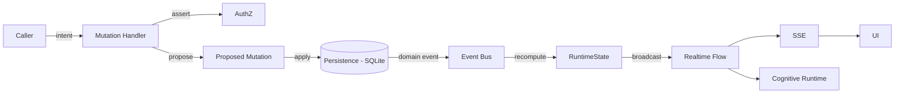

No path from `Caller` to `UI` that bypasses `Persist` is allowed. The frontend never receives a state change that the persistence layer hasn't already recorded.

### VI.5 Optimistic Concurrency and Split-Brain Prevention

- Every `RuntimeState` version increments atomically. Clients receiving state use the version to detect missed updates. On conflict, client requests a snapshot. No silent merges.
- **Split-brain is forbidden**: there is exactly one `RuntimeState` instance per identity, owned by the application core. The UI cannot mutate it. The LLM cannot mutate it. No other process holds a copy. Any component that needs state reads from `RuntimeState` or subscribes to the realtime projection.

### VI.6 Durable State Reconstruction

On application startup:
1. The persistence layer opens the SQLite database.
2. The authoritative durable state is reconstructed from the `domain_event` log (replay) or from a snapshot + tail (configurable).
3. `RuntimeState` is initialized from the authoritative durable state.
4. The cognitive runtime begins accepting new cycles.
5. Realtime flow begins broadcasting from the current `RuntimeState`.

This reconstruction is deterministic and repeatable. No application code may depend on in-memory state that is not in the durable event log.

---

## VII. COGNITIVE RUNTIME (The 12-Stage Cycle)

### VII.1 Stages

```mermaid
flowchart LR
  P1[1. PERCEIVE] --> P2[2. IDENTIFY]
  P2 --> P3[3. RECALL]
  P3 --> P4[4. UNDERSTAND - LLM Proposal]
  P4 --> P5[5. REASON - LLM Trace]
  P6_0[App Validation & Authz]
  P5 --> P6[6. DECIDE - LLM Proposal]
  P6 --> P6_0
  P6_0 --> P7[7. ACT - Action Pipeline]
  P7 --> P8[8. VERIFY - App State Re-read]
  P8 --> P9[9. RESPOND - LLM Draft with Disclosure Policy]
  P9 --> P10[10. LEARN - LLM Extraction Proposal + App Scoped Policy]
  P10 --> P11[11. UPDATE - App Mutator]
  P11 --> P12[12. PERSIST - SQLite Transaction]
  P12 -. next cycle .-> P1
```

| # | Stage | Authority | Responsibility | Output |
| --- | --- | --- | --- | --- |
| 1 | **PERCEIVE** | Application | Receive input (text, audio, system event, proactive trigger). | `RawStimulus` |
| 2 | **IDENTIFY** | Application | Authenticate caller, classify input type, attach context. | `IdentifiedStimulus` |
| 3 | **RECALL** | Application | Apply **Knowledge Retrieval Policy**; load caller-scoped working context (episodic, semantic, preferences, relationships). | `RecalledContext` |
| 4 | **UNDERSTAND** | LLM (Faculty) | LLM proposes interpretation of intent, disambiguates, asks clarifying questions if needed. | `UnderstandingProposal` |
| 5 | **REASON** | LLM (Faculty) | LLM proposes reasoning trace, evaluates options, weighs constraints. | `ReasoningTraceProposal` |
| 6 | **DECIDE** | LLM (Faculty) → Application | LLM proposes a course of action. **Application validates the proposal** (is it well-formed? recognized?) and **authorizes the proposal** against caller permissions. If invalid/unauthorized, application rejects and forces a safe fallback (e.g. clarification, refusal, silence). | `AuthorizedDecision` |
| 7 | **ACT** | Application | Action pipeline executes the authorized decision (if it includes an action). | `ActionResult` |
| 8 | **VERIFY** | Application | Re-read authoritative state, assert preconditions are now postconditions. | `VerificationReport` |
| 9 | **RESPOND** | LLM (Faculty) → Application | LLM drafts user-facing language (text and/or voice); **Application applies Knowledge Disclosure Policy** before output escapes to the caller. | `AuthorizedResponse` |
| 10 | **LEARN** | LLM (Faculty) → Application | LLM proposes candidate memories (preferences, habits, patterns); **Application applies Scoped Learning Policy** (see Part XIII) to decide what may be stored and with what scope. | `AuthorizedLearningDelta` |
| 11 | **UPDATE** | Application | Apply authorized learning delta to in-process state and memory tables. | `UpdateResult` |
| 12 | **PERSIST** | Application | Commit cycle artifacts, domain events, and audit log to durable storage in a single transaction. | `CycleRecord` |

### VII.2 Stage Contracts and LLM Proposal Boundary

Each stage is a **pure function** that takes its input and produces its output. Stages are orchestrated strictly by the `CognitiveRuntime`, which is the only place stage transitions are decided.

The LLM is invoked inside stages 4, 5, 6, 9, and 10 as a **reasoning faculty only**:
- In **Stage 4 (UNDERSTAND)**: LLM proposes an understanding. The application confirms the output matches the expected JSON schema.
- In **Stage 5 (REASON)**: LLM proposes a reasoning trace. The application validates the structure.
- In **Stage 6 (DECIDE)**: LLM proposes a `DecisionProposal`. The **application validates and authorizes** the proposal. The LLM cannot unilaterally execute a tool, write memory, or bypass permissions.
- In **Stage 9 (RESPOND)**: LLM drafts language. The **application runs the Knowledge Disclosure Policy** on the draft to ensure no unauthorized facts, system internals, or unverified claims are disclosed.
- In **Stage 10 (LEARN)**: LLM proposes extracted memories. The **application applies Scoped Learning Policy** to filter, score, deduplicate, and assign identity scope and sensitivity before writing.

The LLM is never the orchestrator. The LLM cannot transition to a next stage on its own, cannot skip a stage, and cannot suppress a stage.

### VII.3 Cycle Boundaries

A cycle is **one full pass** of all 12 stages. Cycles are independent. The runtime may run cycles concurrently for *different* identities, but never concurrently for the same identity (single-threaded per identity to preserve causal order).

### VII.4 Cycle Record

Every completed cycle produces a `CycleRecord` persisted to storage:

```ts
interface CycleRecord {
  id: ULID;
  identityId: IdentityId;
  startedAt: number;
  completedAt: number;
  stages: StageTrace[];           // 12 entries
  proposedDecision: DecisionProposal;
  authorizedDecision: AuthorizedDecision;
  response?: AuthorizedResponse;
  actionResults?: ActionResult[];
  learningDelta?: AuthorizedLearningDelta;
  status: 'completed' | 'interrupted' | 'failed';
}
```

### VII.5 Interruption

A new PERCEIVE for the same identity **interrupts** the current cycle. The interruption:

1. Marks the current cycle as `interrupted` (stages 1-N completed, stages N+1..12 cancelled).
2. Records the interrupting stimulus.
3. Begins a new cycle from PERCEIVE.

The cancellation is recorded in the durable log, never silently dropped. If stage 7 (ACT) was in-flight when the interruption arrived, the action is allowed to complete its verify/persist/rollback before the new cycle begins, preserving transactional integrity.

### VII.6 Verification

- A unit test exists for every stage.
- A property test asserts that for any input, exactly one of stage 1, 2, ..., 12 is the "last completed" stage.
- An integration test asserts that two interleaved cycles for the same identity are serialized.
- A chaos test asserts that mid-cycle crashes produce a recoverable `CycleRecord` with `status: 'interrupted'`.
- A security test asserts that an unauthorized LLM decision proposal is rejected deterministically by stage 6 application validation without executing the requested tool or mutating state.
- A security test asserts that Knowledge Disclosure Policy in stage 9 prevents disclosure of facts loaded into working context that are marked non-disclosable to the current caller.

---

## VIII. EVENT SYSTEM

### VIII.1 Event Taxonomy

```mermaid
flowchart TB
  Ev[Event] --> Dom[Domain Events]
  Ev --> Sys[System Events]
  Ev --> Cog[Cognitive Events]
  Ev --> Voi[Voice Events]
  Ev --> Pro[Proactive Events]
  Ev --> UI[UI Events]

  Dom --> D1[memory.appended]
  Dom --> D2[memory.consolidated]
  Dom --> D3[task.scheduled]
  Dom --> D4[task.completed]
  Dom --> D5[action.executed]
  Dom --> D6[action.failed]
  Dom --> D7[identity.enrolled]
  Dom --> D8[identity.revoked]

  Sys --> S1[boot.completed]
  Sys --> S2[config.changed]
  Sys --> S3[backup.completed]
  Sys --> S4[error.raised]

  Cog --> C1[cycle.started]
  Cog --> C2[cycle.stage.completed]
  Cog --> C3[cycle.completed]
  Cog --> C4[cycle.interrupted]

  Voi --> V1[session.connected]
  Voi --> V2[session.disconnected]

  Pro --> P1[proactive.decision]
  Pro --> P2[proactive.delivered]
  Pro --> P3[proactive.suppressed]
```

### VIII.2 Event Shape

```ts
interface DomainEvent<T extends string, P> {
  id: ULID;
  type: T;
  payload: P;
  identityId?: IdentityId;
  cycleId?: ULID;
  timestamp: number;
  causationId?: ULID;            // the event that caused this one
  correlationId?: ULID;          // the broader workflow
  version: number;
}
```

### VIII.3 Guarantees

- **Ordered**: events are appended in causal order, indexed by sequence number.
- **Durable**: events are persisted before any handler runs.
- **Replayable**: a fresh subscriber can replay from any sequence number.
- **Typed**: every event has a TypeScript type; untyped events are rejected at the boundary.
- **Bounded**: handlers run with deadlines; slow handlers don't block the bus.

### VIII.4 Verification

- A test asserts that every mutation produces exactly one domain event before any consumer sees it.
- A test asserts that the event log is replayable: a new subscriber reading from sequence 0 reaches the same state.
- A test asserts that handlers failing past their deadline do not block the bus.

---

## IX. PERSISTENCE

### IX.1 Why SQLite

- Embedded, single-file, transactional, WAL-mode for concurrent readers.
- Deterministic, debuggable, easy to back up.
- Sufficient for one owner's lifetime of memory (years of episodic entries).
- No external service to fail.

### IX.2 Schema (Multi-Domain, Not One Blob)

The persistence layer has **one table per domain**, never a single key-value bag.

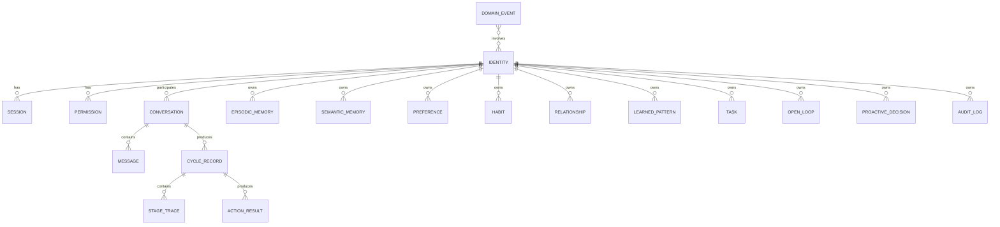

### IX.3 Tables (Authoritative Schema)

| Table | Purpose | Key Columns |
| --- | --- | --- |
| `identity` | One row per known person (owner + enrolled + revoked). | `id`, `kind`, `display_name`, `relationship`, `status`, `enrolled_at` |
| `permission` | Per-identity permission set, versioned. | `identity_id`, `version`, `json`, `effective_from` |
| `session` | Active sessions, refreshable. | `id`, `identity_id`, `issued_at`, `expires_at`, `revoked_at` |
| `conversation` | One row per conversation (voice or text). | `id`, `identity_id`, `started_at`, `ended_at`, `channel` |
| `message` | One row per message. | `id`, `conversation_id`, `role`, `text`, `audio_ref`, `timestamp` |
| `cycle_record` | One row per cognitive cycle. | `id`, `conversation_id`, `started_at`, `completed_at`, `status` |
| `stage_trace` | One row per stage per cycle. | `cycle_id`, `stage`, `started_at`, `completed_at`, `output_json` |
| `action_result` | One row per action execution. | `id`, `cycle_id`, `tool_id`, `input_json`, `output_json`, `verified`, `persisted_at` |
| `episodic_memory` | Time-stamped memories of events. | `id`, `identity_id`, `summary`, `embedding`, `occurred_at`, `importance` |
| `semantic_memory` | Distilled facts. | `id`, `identity_id`, `subject`, `predicate`, `object`, `confidence`, `source_cycle` |
| `preference` | User-stated preferences. | `id`, `identity_id`, `key`, `value`, `stated_at`, `confidence` |
| `habit` | Inferred habits (recurring patterns). | `id`, `identity_id`, `pattern`, `frequency`, `last_observed` |
| `relationship` | People known to the owner. | `id`, `owner_id`, `name`, `relation`, `notes`, `importance` |
| `learned_pattern` | Behavioral patterns Madhurita has inferred. | `id`, `identity_id`, `pattern`, `evidence_count`, `confidence` |
| `task` | Scheduled or one-shot tasks. | `id`, `identity_id`, `kind`, `payload`, `due_at`, `status` |
| `open_loop` | Unfinished threads Madhurita is tracking. | `id`, `identity_id`, `topic`, `opened_at`, `last_progress` |
| `proactive_decision` | Record of proactive reasoning. | `id`, `identity_id`, `decision`, `urgency`, `novelty`, `interruption_cost`, `acted_at` |
| `audit_log` | All auth, mutation, and disclosure events. | `id`, `actor_id`, `action`, `resource`, `decision`, `timestamp` |
| `domain_event` | Append-only event log. | `seq`, `id`, `type`, `payload_json`, `identity_id`, `cycle_id`, `timestamp` |
| `backup_metadata` | Backup snapshots. | `id`, `created_at`, `sha256`, `size_bytes`, `restored_from` |

### IX.4 Embedding Strategy

- Embeddings are stored alongside episodic and semantic rows in a separate column.
- A simple `embedding` table is avoided; embedding lives with the row.
- Embedding model is configurable; default to the LLM provider's embedding endpoint.

### IX.5 Transactions

Every mutation is a transaction. Transactions include:

- All table writes for the mutation.
- The corresponding `domain_event` append.
- The `audit_log` row.

If any step fails, the transaction rolls back. The system never has a partial state.

### IX.6 Deletion Safety

- Soft delete by default (`deleted_at` column where relevant).
- `audit_log` is never soft-deleted.
- A "Bin" view shows soft-deleted items, with owner-only restore.
- A separate "hard delete" operation exists for explicit, multi-step, confirmed removal.
- A "memory provenance" record tracks which memories derive from which conversation/event.

### IX.7 Verification

- A test asserts that every mutation is atomic (no partial state after crash injection).
- A test asserts that soft-deleted items are excluded from all retrieval paths.
- A test asserts that the audit log cannot be silently altered (write-once semantics).

---

## X. MEMORY SYSTEM

### X.1 The Multi-Domain Principle

There is **no single generic "memories" bag.** Memory is partitioned by *kind*, because each kind has different shape, lifecycle, retrieval semantics, and sensitivity rules:

| Domain | Lifetime | Retrieval Trigger | Update Cadence | Sensitivity Default |
| --- | --- | --- | --- | --- |
| **Raw conversation** | Permanent | Always available to its identity | Append-only | Identity-private |
| **Episodic** | Long | Time-based, similarity | Consolidated periodically | Identity-private |
| **Semantic** | Long | Subject lookup, similarity | Updated on new evidence | Scoped by subject |
| **Preferences** | Long | Always | Updated on user statement | Identity-private |
| **Habits** | Long | Pattern detection | Updated on observation | Identity-private |
| **Relationships** | Long | Identity resolution | Updated on new info | Owner-private |
| **Learned patterns** | Long | Behavioral inference | Updated on consolidation | Scoped by subject |

Every memory row, regardless of domain, carries the **common memory header**:

```ts
interface MemoryItemHeader {
  id: ULID;
  identityId: IdentityId;          // subject / owner of this memory
  subjectKind: 'owner' | 'person' | 'guest' | 'system';
  sensitivity: 'public' | 'person_shared' | 'owner_only' | 'system_internal';
  confidence: number;              // 0..1
  sourceKind: 'conversation' | 'action' | 'observation' | 'system';
  provenance: MemoryProvenance;
  createdAt: number;
  updatedAt: number;
  expiresAt?: number;              // optional TTL
  lifecycleStatus: 'active' | 'consolidated' | 'archived' | 'soft_deleted';
  deletedAt?: number;
  deletedBy?: IdentityId;
}
```

### X.2 Memory Lifecycle

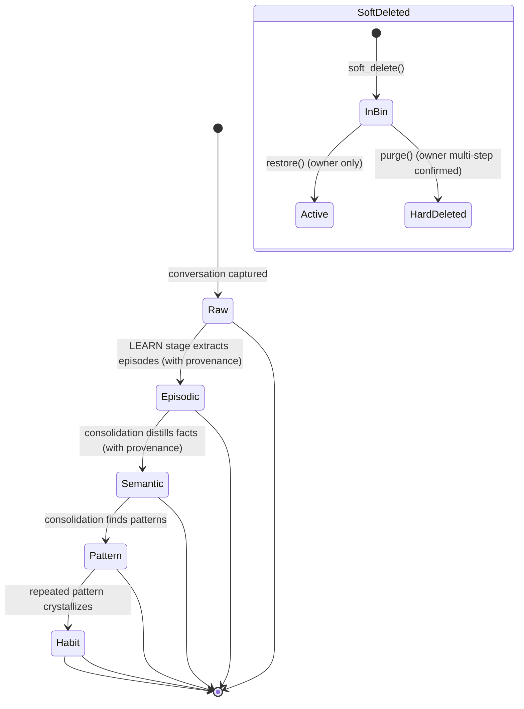

### X.3 Retrieval — Knowledge Retrieval Policy and Caller-Scoped Working Context

Retrieval is **never an unconstrained query against all memory.** Retrieval is mediated by the **Knowledge Retrieval Policy**, which is entirely application-defined and deterministic. The LLM never performs retrieval directly and never sees raw memory rows.

```
Caller Identity + Permissions
        ↓
KNOWLEDGE RETRIEVAL POLICY (application-defined, deterministic)
        ↓
Identity-Scoped + Domain-Scoped + Sensitivity-Filtered DB Query
        ↓
Ranking (recency + importance + similarity)
        ↓
CALLER-SCOPED WORKING CONTEXT (projected into LLM context in Stage 3)
```

```ts
interface RetrievalRequest {
  callerId: IdentityId;
  callerKind: 'owner' | 'person' | 'guest';
  query: string;                  // natural language or structured
  domains: MemoryDomain[];        // which memory kinds to search
  limit: number;
  recencyWeight: number;          // 0..1
  importanceWeight: number;       // 0..1
  similarityWeight: number;       // 0..1
  excludeSoftDeleted: boolean;    // default true
}

interface RetrievalResult {
  items: ScopedMemoryItem[];      // ranked and filtered by policy
  total: number;
  took: number;                   // ms
  fromCache: boolean;
}
```

The Knowledge Retrieval Policy enforces three mandatory constraints:

1. **Identity Isolation**: A guest's retrieval request never returns owner memories, owner preferences, or records about other persons.
2. **Sensitivity Gates**: Items marked `owner_only` are only retrieved when `callerKind === 'owner'`.
3. **Soft-Delete Exclusion**: Items with `lifecycleStatus === 'soft_deleted'` are excluded from all routine retrieval paths.

### X.4 Knowledge Disclosure Policy

Even after an item is loaded into the caller-scoped working context, it is not automatically permitted to appear in Madhurita's output. In Stage 9 (RESPOND), the **Knowledge Disclosure Policy** evaluates the LLM-drafted response before delivery:

1. Every referenced entity, fact, and preference is checked against the caller's permission set.
2. If an unauthorized fact is present in the draft, the application replaces it with a safe generalization or redacts it before output.
3. All disclosures are recorded in the `audit_log`.

The LLM drafts the response; the application applies the disclosure gate. The LLM does not apply the gate itself. The application's disclosure check is mandatory and cannot be bypassed.

### X.5 Memory Provenance

Every memory item carries a durable, auditable chain of evidence:

```ts
interface MemoryProvenance {
  sourceCycleId: ULID;
  sourceConversationId: ULID;
  sourceMessageIds: ULID[];
  extractedAt: number;
  extractor: 'rule' | 'llm';
  confidence: number;
  validatedBy: 'app_rule' | 'owner_confirmation' | 'auto_policy';
}
```

No memory is stored without provenance. Provenance is the chain that lets the owner audit, correct, or delete. When extractor is `'llm'`, that means the LLM *proposed* the memory extraction; the application validated the proposal against policy (`validatedBy`) before writing. The LLM may not write memories directly.

### X.6 Verification

- A test asserts that retrieval by a guest never returns owner memories.
- A test asserts that retrieval by a known person returns only items authorized for their relationship and sensitivity level.
- A test asserts that provenance is present on every memory item in every domain.
- A test asserts that soft-deleted memories are invisible to retrieval.
- A test asserts that the Knowledge Disclosure Policy blocks output of owner-only facts even when they were present in working context.
- A test asserts that the LLM extraction proposal path writes nothing to the DB before application validation completes.

---

## XI. ACTION PIPELINE (The 7 Stages)

### XI.1 Stages


| # | Stage | Responsibility | Failure Mode | Authority |
|---|-------|----------------|--------------|-----------|
| 1 | **UNDERSTAND** | Parse the action request, identify the tool needed, classify parameters. **LLM may propose the understanding; application validates and authorizes.** | Reject as "malformed" | LLM Faculty → Application |
| 2 | **PLAN** | Construct the call graph: which tool, in what order, with which parameters. **LLM may propose the plan; application validates and authorizes.** | Reject as "unplannable" | LLM Faculty → Application |
| 3 | **AUTHORIZE** | Application enforces `authz.check(identity, tool, params)` against caller permissions. No LLM role. | Reject as "unauthorized" | Application |
| 4 | **EXECUTE** | Run the tool, with deadlines, retries bounded. Application executes; LLM does not execute tools. | Reject as "execution failed" | Application |
| 5 | **VERIFY** | Re-read authoritative state, assert the preconditions are now postconditions. Application performs verification; LLM does not verify. | Reject as "unverified" | Application |
| 6 | **PERSIST** | Write `action_result` row, emit `action.executed` domain event. Application persists; LLM does not persist. | Roll back the tool if possible | Application |
| 7 | **RESPOND** | Generate the user-facing language describing the result. **LLM drafts the response; application applies Knowledge Disclosure Policy and authorizes output.** | Surface error plainly | LLM Faculty → Application |

**Critical principle**: The LLM is a reasoning faculty in stages 1, 2, and 7. The LLM **proposes** understanding, plans, and response drafts. The **application validates and authorizes** every LLM proposal before it takes effect. The LLM never unilaterally transitions to the next stage, never skips a stage, and never suppresses a stage.

### XI.2 Tool Registry

```ts
interface ToolDefinition {
  id: ToolId;
  description: string;
  inputSchema: ZodSchema;
  outputSchema: ZodSchema;
  requiredPermissions: PermissionId[];
  sideEffects: 'none' | 'read' | 'write' | 'external';
  maxRetries: number;
  timeoutMs: number;
}

interface ToolContext {
  identityId: IdentityId;
  cycleId: ULID;
  causationId: ULID;
}
```

### XI.3 Verification Is Mandatory

A textual "done" is never proof. The VERIFY stage **must** re-read authoritative state (RuntimeState → SQLite) and assert that the intended change occurred. If VERIFY fails, the action is **not** considered successful — it is rolled back where possible, and the failure is recorded in the `action_result` table with `verified: false`. The user is never told an action succeeded unless VERIFY passed.

**The three booleans, and which stage owns each.** `ActionResult` carries `attempted`, `success` and `verified`, and no stage may set another stage's field:

| Field | Meaning | Set by | Never inferred from |
|---|---|---|---|
| `attempted` | The call was dispatched to an executor. | Cognitive stage 7 | anything — stage 7 knows whether it dispatched |
| `success` | The call returned without throwing. | Cognitive stage 7 | `attempted` (a dispatched call may throw) |
| `verified` | A re-read of authoritative state found the change. | Cognitive stage 8 only | `success` (a returned call proves nothing) |

Cognitive stage 9 speaks from all three and has a different sentence for each state: confirmed, *ran but unconfirmed* ("I started on that, but I could not confirm it actually went through"), and *never dispatched* ("I did not do that — it is not something I can carry out right now, so nothing has changed on your side"). The second sentence over the third state is the defect the field exists to prevent — see II.5. The refusal sentence deliberately does not name **why**: three of stage 7's four pre-dispatch refusals are her own configuration or her own authorization verdict, which are the inside of the machine, and the fourth (the caller is not cleared) is already recorded by stage 6 where an audit can read it.

`FLAG_ACTIONS` is the flag that reaches this: off, `runtimeFor` withholds the executor and nothing else. Stage 6 still chooses the tool, stage 7 records `attempted: false` with `'No tool executor is wired; action is disabled'`, and stage 9 says it did not happen. Gating the *decision* instead would leave no trace that anything had been declined.

### XI.4 Verification

- A test asserts that for every action, VERIFY either confirms the postcondition or rolls back.
- A test asserts that unverified actions are never surfaced as success to the user.
- A test asserts that an `EXECUTE` that crashes mid-call leaves no orphaned state.
- A test asserts that an LLM-proposed UNDERSTAND or PLAN that is invalid or unauthorized is rejected by the application before AUTHORIZE.
- A test asserts that an LLM-drafted RESPONSE that fails the Knowledge Disclosure Policy is redacted or generalized before output.
- A test asserts that a call refused before dispatch is reported as `attempted: false` and is spoken as "it did not happen", never as "it could not be confirmed".
- A test asserts that with `FLAG_ACTIONS` off the decision still names the tool, the durable effect is absent, and the refusal reaches the caller as language.

---

## XII. TASKS & LOOPS

### XII.1 Tasks

A task is **durable, scheduled, executable work** that may outlive a single conversation.

```ts
interface Task {
  id: ULID;
  identityId: IdentityId;
  kind: 'reminder' | 'recurring' | 'one_shot' | 'background';
  payload: TaskPayload;
  schedule: TaskSchedule;
  status: 'pending' | 'running' | 'completed' | 'failed' | 'cancelled';
  createdAt: number;
  dueAt?: number;
  lastRunAt?: number;
  nextRunAt?: number;
  attempt: number;
  maxAttempts: number;
}
```

### XII.2 Loop Manager

A loop is a **long-running intent** the owner has placed on Madhurita. Examples:

- "Track my sleep and remind me if I sleep under 6 hours for three nights."
- "Keep an eye on weather and warn me before it rains."

Loops are not tasks; they are *generators* of tasks.

```ts
interface OpenLoop {
  id: ULID;
  identityId: IdentityId;
  topic: string;
  triggerSpec: TriggerSpec;
  actionSpec: ActionSpec;
  status: 'active' | 'paused' | 'closed';
  openedAt: number;
  lastEvaluatedAt: number;
  lastProgressAt: number;
}
```

### XII.3 Evaluation

The `LoopManager` evaluates every active loop:

- On every relevant domain event.
- On every environmental change.
- On a periodic tick (default 15 minutes).

Each evaluation produces a `LoopEvaluation` record; if it decides action is needed, it creates a `Task`.

### XII.4 Verification

- A test asserts that a loop's evaluation never produces duplicate tasks for the same condition.
- A test asserts that closed loops do not produce tasks.
- A test asserts that loops respect the owner's notification preferences.

---

## XIII. LEARNING SYSTEM

### XIII.1 What Learning Is

Learning is the **deliberate extraction of memory from cycles.** It is not the LLM continuing a conversation; it is the application observing what happened and writing structured knowledge back to memory. The LLM may propose extractions, but the application validates, scores, dedupes, limits, and records provenance.

### XIII.2 Pipeline

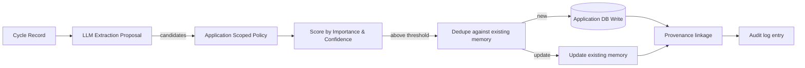

### XIII.3 What Gets Learned

| Trigger | Learned Kind |
| --- | --- |
| User says "I love jazz" | `preference` |
| User asks about project X three times this week | `learned_pattern` (interest in X) |
| User corrects Madhurita | `preference` (correction captured) |
| User mentions a person by name and relationship | `relationship` |
| Repeated behavior over 7+ days | `habit` |
| Generalizable fact about the user's life | `semantic` |
| A specific moment in time | `episodic` |

### XIII.4 Scoped Guest Learning Policy (What Does Not Get Learned)

Madhurita does **not** implement a blanket "guests teach nothing" rule, nor does she silently convert guest conversation into owner memory. Instead, guest-originated information is evaluated by the **Scoped Guest Learning Policy**:

| Information Subject | Application Policy Outcome |
|---------------------|----------------------------|
| Small talk / idle context | Transient only, discarded after session. |
| Guest's own preferences | Saved as Guest-scoped `preference`. Completely isolated from Owner. |
| General behavioral patterns | May be saved as `learned_pattern` (e.g. "guests often ask X"). |
| Information about the Owner | **Quarantine**: Saved as `unverified_semantic` with Guest provenance. Owner confirmation is required before it becomes general memory. |
| Sensitive/Private | Discarded unless explicitly authorized. |

The LLM proposes the extraction; the application evaluates the caller identity, the subject of the memory, and the sensitivity, then applies the mandatory policy.

Regardless of identity:
- Transient emotional state is never learned as permanent memory.
- Unverified claims about third parties are discarded.
- Anything the owner later marks as wrong or soft-deletes is removed.

### XIII.5 Verification

- A test asserts that every learned item carries a `MemoryProvenance` linking back to the extracting cycle.
- A test asserts that guest-originated information about the Owner is never written to public/owner memory without owner confirmation.
- A test asserts that a guest's own preferences are isolated and never returned in an Owner-scoped retrieval query.
- A test asserts that user corrections create preference updates with high confidence.
- A test asserts that the LLM cannot bypass the Dedupe or Scoped Guest Learning Policy stages.

---

## XIV. PROACTIVE ENGINE

### XIV.1 The Proactivity Decision

Proactivity is a **cognitive decision**, not a scheduled event. The LLM may **propose** proactive candidates during stages 5–6 of the cognitive cycle. The **application** evaluates every candidate against a deterministic decision tree, and the application is the final authority on whether a proactive message is emitted. The LLM is never the final authority for whether Madhurita is allowed to proactively contact someone.

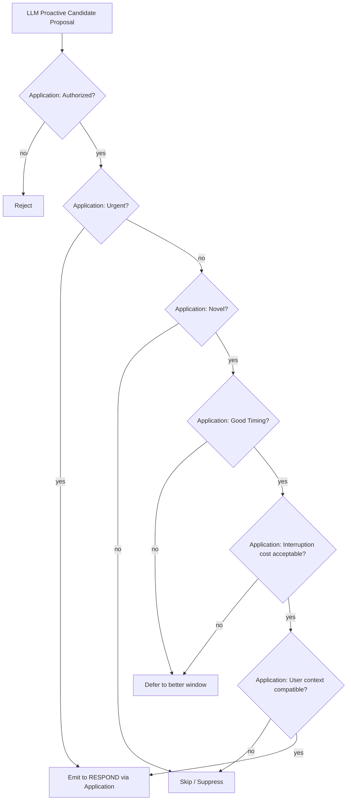

**Every branch in the decision tree is application-defined. The LLM does not run this tree; the application runs it against the candidate.**

### XIV.2 Decision Output

```ts
type ProactiveDecision =
  | { kind: 'speak'; channel: 'text' | 'voice'; priority: 'low' | 'normal' | 'high' }
  | { kind: 'act'; toolId: ToolId; payload: unknown }
  | { kind: 'ask'; question: string }
  | { kind: 'wait'; until: number }
  | { kind: 'silent' };
```

### XIV.3 Anti-Spam Guarantees

The application enforces these deterministic constraints before any LLM candidate is emitted:

- Per-topic rate limit (max one proactive per topic per hour by default).
- Quiet hours honored unless urgent.
- Owner may globally disable proactivity; per-topic disable also allowed.
- Proactive silence is the default, not the exception.
- Guest sessions never receive proactive messages.
- Relevance, novelty, and authorization checks are mandatory. The LLM may assist with semantic relevance scoring but the application enforces the threshold.

### XIV.4 Verification

- A test asserts that a candidate not novel enough is suppressed, not delayed.
- A test asserts that quiet hours suppress non-urgent proactivity.
- A test asserts that globally disabled proactivity never produces a `speak` or `act` decision.
- A test asserts that the LLM cannot directly emit a proactive message without the application running the full decision tree.
- A test asserts that a guest session never receives proactive output.

---

## XV. VOICE & LIVE SESSION

### XV.1 Two Voice Modes

| Mode | Use Case | Latency Target |
| --- | --- | --- |
| **Push-to-talk / always-on** | Owner-driven live conversation | <250ms round trip |
| **TTS reply** | Madhurita speaks, owner listens | <300ms first audio byte |

The system supports both. They share audio plumbing but have different control flows.

### XV.2 Live Session State Machine

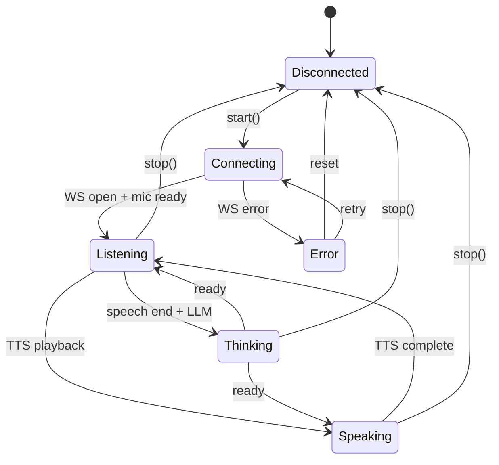

### XV.3 Audio Plumbing

- **Capture**: Web Audio API → `AnalyserNode` (waveform) + `ScriptProcessor` / `AudioWorklet` (PCM frames).
- **Playback**: TTS bytes → `AudioBufferSourceNode` → `AnalyserNode` (waveform).
- **Streaming**: WebSocket frames to/from the Gemini Live endpoint.
- **Realtime UI**: waveform stays in the browser. `AnalyserNode.getByteTimeDomainData()` is read where it is produced, on the client that owns the microphone and the speaker, and never crosses the network — the four `VoiceState` waveform fields that once carried it server-side are gone (see the note at the end of **VI.3**).

### XV.4 Verification

- A test asserts that mic capture cannot be started without a confirmed live session.
- A test asserts that TTS playback honors user volume preferences.
- A test asserts that any audio-driven motion reflects actual amplitude, not a fake animation on a timer.

---

## XVI. REALTIME FLOW (The 7-Stage Broadcast)

### XVI.1 The Contract

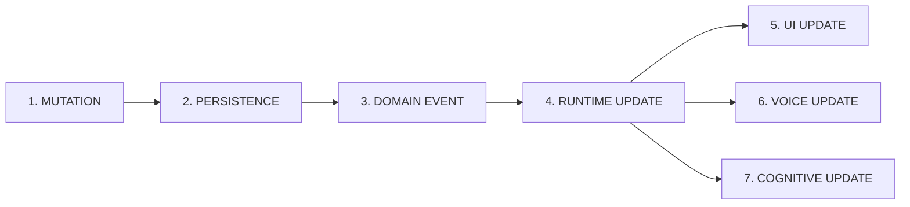

No mutation may skip a stage. No UI update may precede persistence.

### XVI.2 Backpressure

If a client is slow, the realtime channel **coalesces** consecutive updates to the same field, sending only the latest. The client never receives a stale field after a newer one.

### XVI.3 Verification

- A test asserts that the event log is in lockstep with the broadcast log.
- A test asserts that a slow client never causes the producer to block.
- A test asserts that disconnection causes no data loss (events persist; client catches up on reconnect).

---

## XVII. VISUAL DIRECTION — WITHDRAWN

This slot held three Parts and roughly 650 lines of specification: **XVII. UI Shell & Visual Language**, **XVIII. Visual & Rendering Architecture (The Cinematic Environment)**, and **XIX. Background Atmosphere**. They are withdrawn by owner decision. The numbering is left as one part rather than renumbered, so that every cross-reference elsewhere in this book still resolves and so that the gap reads as a decision instead of an accident.

### XVII.1 What Was Withdrawn

A photoreal-cinematic direction, specified down to the shader: a GPU-rendered lake with Gerstner waves and real-time planar reflection, a physically-inspired optical orb with transmission, refraction, Fresnel and volumetric light, WebGPU-primary with a WebGL2 fallback, photographic landscape layers with particle atmosphere, an audio→GPU uniform path deliberately routed around React, and pixel-comparison visual regression at several device tiers.

Three reference images in `docs/` belong to that direction. **They are not a brief.** They are the record of an approach that was tried and dropped, and nothing in the current UI is meant to resemble them.

### XVII.2 Why

The direction was heavy in exactly the way the product should not be. It committed the interface to being the most expensive thing in the system — a renderer whose frame budget, device tiering and reference-image test suite would have outweighed the cognition it was supposed to be a window onto. It also inverted the priority: Madhurita is an entity that thinks, and the spec had grown a body more elaborate than the mind.

The replacement direction, given by the owner directly, is the opposite: **flagship feel through restraint.** Ultra-smooth and highly optimised, luxury rather than cheap, PS5-grade in polish and confidence — but clean, subtle, minimal, and *not* UI-heavy, with a light signature sound. Original, not a copy of anything, and specifically not a dashboard with a glass sphere on it.

### XVII.3 What This Withdrawal Does Not Touch

Everything else in this book stands unchanged. The withdrawal is scoped to presentation, and the reason it can be scoped that cleanly is **XVIII.0**, the one rule from the deleted part that was worth keeping and is restated here as the whole of what remains:

> The visual system is a **presentation layer** over authoritative `RuntimeState`. It **visualizes** application state; it never **creates** it. It is not a source of truth for identity, cognition, memory, authorization, or task state. Visual state is derived. It is not authoritative.

Because that boundary was held, removing the renderer removed no domain logic. What it did remove were five `RuntimeState` fields that existed only to feed it — `CognitiveState.attention` and `VoiceState`'s `energy`, `ttsEnergy`, `frequencyBands` and `voiceId` — each written as a constant and read by nothing. The reasoning is recorded at the end of **VI.3**.

### XVII.4 The Standing Visual Constraints

What is left of a visual specification is short enough to fit here, and it is deliberately expressed as constraints rather than as a composition:

- **Derived, never hand-tuned.** Colour, light and motion come from authoritative `EnvironmentState`, `CognitiveState` and `VoiceState`. There are no per-screen palettes.
- **Minimal surface.** Nothing is drawn that does not carry information. Chrome is not a feature.
- **Smooth above ornate.** A dropped frame is a worse defect than a plain surface. Motion is subtle, continuous, and interruptible.
- **Signature sound, sparing.** A small, coherent set of interface sounds. Silence is the default.
- **Interior life stays interior.** Her awareness of her own circuits, wiring and diagnostics is not a UI panel. She can *report* on it when asked; the interface does not display it. This is a product rule, not a visual one, and it is why no part of this book specifies a "system status" screen.
- **Accessible by construction.** Contrast, focus order, reduced-motion and keyboard reachability are requirements, not a later pass.

### XVII.5 Verification

Pixel-comparison visual regression is withdrawn with the direction that needed it — reference frames are the wrong test for a surface whose whole job is to be derived from changing state, and they were the most expensive tests in the plan.

What is verified instead:

- A test asserts that rendered colour is derived from authoritative state and that no component holds a palette of its own.
- A test asserts the interface reads `RuntimeState` and never writes it.
- A test asserts that with all environment inputs absent, the interface still renders — no location, no weather, no live voice.

---

## XX. ADVANCED INTELLIGENCE

### XX.1 Sub-Modalities (Planned, Post-MVP)

| Modality | Purpose | Trigger |
| --- | --- | --- |
| **Emotion reading** | Infer affective state from voice features | During listening |
| **Personality modulation** | Adjust verbosity, formality, warmth per user | Per identity |
| **Relationship context** | Recall who matters to whom in ongoing dialogue | During UNDERSTAND |
| **Long-horizon reflection** | Daily/weekly summaries for owner | Scheduled |
| **Dream consolidation** | Off-line memory consolidation during quiet hours | Scheduled |
| **Multi-person coordination** | Handle multiple known persons in one conversation | When present |

### XX.2 Where They Live

Each is a `CognitiveModule` that hooks into one or more of the 12 stages. They are *opt-in* modules, with explicit feature flags and isolation so a failure in one cannot crash the runtime.

### XX.3 Verification

- Each module has its own test suite and runtime guard.
- A test asserts that disabling all advanced modules leaves a working MVP.

---

## XXI. TESTING STRATEGY

### XXI.1 Test Pyramid

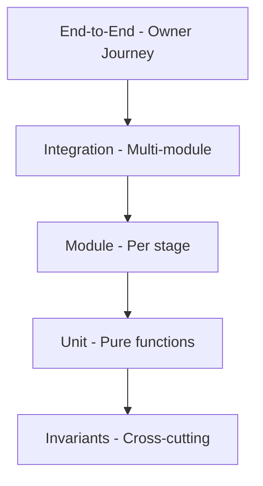

### XXI.2 Test Categories (A–G)

The test suite is organized into seven cross-cutting categories, each enforced by at least one invariant that runs in CI. No phase is "complete" without all category tests for that phase passing.

| Category | Purpose | Scope |
| --- | --- | --- |
| **A. Authority** | LLM never bypasses application authority. LLM may not mutate DB, may not execute tools, may not authorize, may not emit authoritative events, may not persist memory. | Cognitive stages 4–7, 10; Action stages 1, 2, 7; Proactivity; Learning |
| **B. Memory** | Memory is multi-domain, scoped, sensitive, soft-deletable. | Retrieval, Provenance, Sensitivity, Soft-Delete |
| **C. Runtime** | RuntimeState is the one live projection; no split-brain; durable state reconstructs deterministically. | State projection, Concurrency, Reconstruction |
| **D. Actions** | Every action is verified; unverified actions are never reported as success. | Action pipeline stages 3–7 |
| **E. Proactivity** | Proactive decisions follow the deterministic decision tree; anti-spam guarantees hold; guests never receive proactive output. | Proactive engine |
| **F. Guest Isolation** | Guests cannot access owner memory or other persons' memory; Knowledge Retrieval Policy and Knowledge Disclosure Policy enforce identity isolation. | Retrieval, Disclosure, Guest Learning |
| **G. Failure** | Interruption, crash, and rollback are explicit and observable. | Cognitive cycle, Action rollback, Domain event replay |

### XXI.3 Standard Categories (Reuse Infrastructure)

| Category | Purpose | Tools |
| --- | --- | --- |
| **Unit** | Pure functions, no IO. | Native runner. |
| **Module** | Single module, mocked IO. | Native runner. |
| **Integration** | Multiple modules, real DB. | Native runner + SQLite. |
| **Invariants** | Cross-cutting properties (e.g. "every mutation is atomic"). | Native runner + property tests. |
| **End-to-end** | Real owner journey through real frontend. | Playwright (planned). |
| **Chaos** | Crash injection, latency injection, partition. | Custom. |

### XXI.4 Coverage Targets

- **Cognitive stages**: 100% line, 100% branch.
- **Action pipeline**: 100% line, 100% branch.
- **Persistence**: 100% of happy + sad paths.
- **Event bus**: 100% of stage transitions.
- **UI shell**: 80% line, 100% of state-driven render branches.

### XXI.5 Test Isolation

- Every test gets a fresh, in-memory SQLite instance.
- No test depends on another test's state.
- Time is injectable; no `Date.now()` calls in domain code.
- LLM is mocked at the **adapter boundary** for unit and module tests. The application enforces all authority and policy checks regardless of LLM output, so test mocks do not weaken those guarantees.

### XXI.6 Required Invariant Examples (A–G)

- **A.1**: An LLM-proposed action that fails `authz.check` is rejected before EXECUTE. No exception, no fallback to "best effort."
- **A.2**: The LLM may not write directly to the SQLite DB. The LLM extracts proposals; the application validates and writes.
- **B.1**: Retrieval by a guest never returns owner memories.
- **B.2**: Every memory row has a `MemoryProvenance` linking to the originating cycle.
- **C.1**: After every mutation, RuntimeState projection matches SQLite row counts for the affected entity.
- **C.2**: Restart from a persisted SQLite snapshot reconstructs RuntimeState identically (deterministic).
- **D.1**: An action that crashes mid-EXECUTE leaves the DB in the pre-action state.
- **D.2**: An action that fails VERIFY is reported to the user as unverified, not as success.
- **E.1**: Quiet hours suppress non-urgent proactivity.
- **E.2**: Guests never receive proactive output.
- **F.1**: Knowledge Disclosure Policy redacts owner-only facts from guest-facing responses.
- **G.1**: An interrupted cognitive cycle is recorded with `status: 'interrupted'` and the system resumes cleanly.

---

## XXII. PERFORMANCE & LATENCY

### XXII.1 Targets

| Surface | Target | Stretch |
| --- | --- | --- |
| **Text round-trip** | <300ms | <200ms |
| **Voice round-trip** | <250ms | <180ms |
| **Realtime state broadcast** | <150ms mutation → UI | <100ms |
| **Cognitive cycle** | <800ms for routine | <400ms for routine |
| **Action pipeline** | <500ms read actions | <1s write actions |
| **Interface frame** | 60fps sustained, no dropped frames during transitions | 120fps where the display allows |
| **Cold start** | <3s to first paint | <2s |

### XXII.2 Knobs

- DPR cap: `Math.min(window.devicePixelRatio, 2)`.
- Motion: reduced or removed under `prefers-reduced-motion`.
- LLM token budgets: per-stage, configurable, with hard ceilings.
- Realtime coalescing: 50ms window for consecutive updates to the same field.

### XXII.3 Verification

- A load test asserts that 10 rapid mutations don't drop any.
- A perf test asserts the interface holds 60fps on a 2019 mid-range laptop.
- A test asserts that `prefers-reduced-motion` is honored.

---

## XXIII. SECURITY & PRIVACY

### XXIII.1 Threat Model

| Threat | Mitigation |
| --- | --- |
| Unauthorized person accesses owner data | Application-side **Knowledge Retrieval Policy** enforces per-identity isolation. |
| LLM authorizes unauthorized action | LLM proposes; Application enforces **AUTHORIZE** stage against permissions. |
| LLM leaks private data in output | Application enforces **Knowledge Disclosure Policy** in stage 9 before output. |
| LLM writes false data to memory | LLM proposes extraction; Application validates via **Scoped Guest Learning Policy**. |
| Injection via user text | All tool input validated with Zod. Application maintains authority over execution. |
| Cross-tenant data leak | Single-instance per owner; no shared DB. |
| Token theft | Short-lived sessions, refresh-on-activity, revocable. |
| Eavesdropping on voice | TLS for transport; ephemeral mic permission. |
| Audit gap | Every action and every disclosure decision emits `audit_log` row. |
| Backup exfil | Backups encrypted at rest with owner-derived key. |

### XXIII.2 Privacy Defaults

- Guests are subjected to the strict isolation boundary of the **Knowledge Retrieval Policy**.
- Guests' own preferences are quarantined from general memory via the **Scoped Guest Learning Policy**.
- Responses are scrubbed of unauthorized facts by the **Knowledge Disclosure Policy**.
- No data leaves the host for any third party except the configured LLM provider, and only the minimum required.
- The owner can export and delete all data at any time.

### XXIII.3 Verification

- A security test asserts that a guest cannot enumerate the owner's identities.
- A security test asserts that a person cannot read another person's memory.
- A security test asserts that all tool inputs are validated against their schema before execution.
- A security test asserts that the application rejects an unauthorized LLM tool-execution proposal before the EXECUTE stage.
- A security test asserts that the application redacts an LLM-drafted response if it violates the Knowledge Disclosure Policy.

---

## XXIV. CONFIGURATION & SECRETS

### XXIV.1 What Is Configurable

- LLM provider and model.
- TTS voice and parameters.
- Quiet hours.
- Notification preferences.
- Proactivity toggles per topic.
- Backups (schedule, destination).

### XXIV.2 What Is Not Configurable

- The 12-stage cycle.
- The 7-stage action pipeline.
- The 7-stage realtime flow.
- The memory domain split.
- The event log structure.
- The persistence schema (without migration).

### XXIV.3 Secrets

- API keys via `.env`, never in the DB, never in the UI.
- Owner-derived encryption keys never leave the device.
- No secret is logged.

---

## XXV. ROLLOUT, MIGRATION, ROLLBACK

### XXV.1 Phased Rollout

The rebuild rolls out in **causally ordered micro-phases** (see Part XXVI). Each phase has a clear checkpoint, a clear rollback path, and a clear pass criterion.

### XXV.2 Migration Strategy

- The new application gets a **fresh database, fresh schema**.
- The new system must boot and work correctly from an **empty database**. Legacy DB import is **not** a prerequisite and is **not part of this rebuild**.
- Database migrations apply only to the **new schema** via `server/persistence/migrate.ts` and the SQL files in `server/persistence/migrations/`. These are forward-only, versioned schema migrations that run at boot.
- The old DB is never opened by the new runtime during the rebuild. The old DB file is not part of the new runtime and is not required to be preserved as an archive.

### XXV.3 Rollback

There is no "fall back to the legacy application." The old application architecture is not a rollback target.

Rollback within the new architecture works as follows:

- Each phase is gated behind a feature flag.
- Disabling a flag **removes the incomplete capability**. It does **not** revert to a legacy system.
- The rollback target is always: **last verified new phase**.
- DB migrations are paired with `down` scripts that undo the new phase's schema additions.
- If a phase fails and cannot be disabled cleanly, the system stops at the last verified checkpoint and the failure is recorded in `docs/MADHURITA.md` under "What is not done".

---

## XXVI. IMPLEMENTATION ROADMAP (Causally Ordered Micro-Phases)

This is the **single ordered list** the implementation will follow. Each phase is small enough to verify in one sitting, large enough to be meaningful. No phase may begin before its dependencies are complete and verified.

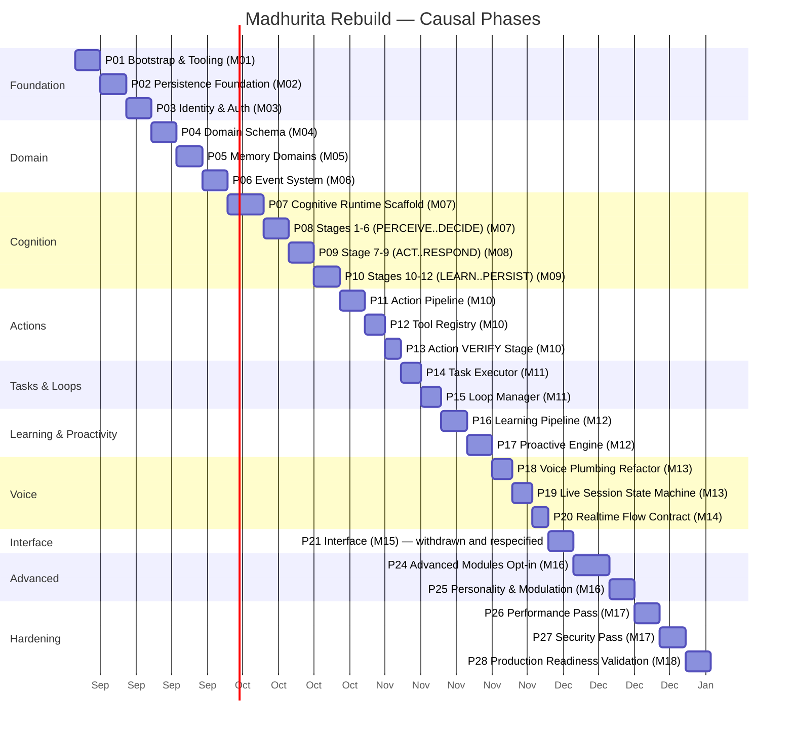

### XXVI.1 Phase Index

| Phase | Milestone | Checkpoint | Rollback |
| --- | --- | --- | --- |
| **P01 — Bootstrap & Tooling** | M01 | Repo, scripts, env, CI scaffold | n/a |
| **P02 — Persistence Foundation** | M02 | SQLite + WAL, migrations, schema | Revert migrations |
| **P03 — Identity & Auth** | M03 | Bootstrap, sessions, authZ | Revert migrations |
| **P04 — Domain Schema** | M04 | All tables from Part IX.3 | Revert migrations |
| **P05 — Memory Domains** | M05 | Multi-domain stores, retrieval, provenance | Disable memory service; last verified phase |
| **P06 — Event System** | M06 | EventBus, ordered, replayable | Disable bus; direct call passthrough |
| **P07 — Cognitive Scaffold** | M07 | Runtime, cycle record, 12 stage stubs | Disable cognition; runtime returns passthrough |
| **P08 — Stages 1–6** | M07 | PERCEIVE..DECIDE wired | Disable stages 4-6; return default decision |
| **P09 — Stages 7–9** | M08 | ACT, VERIFY, RESPOND | Disable action; return text-only response |
| **P10 — Stages 10–12** | M09 | LEARN, UPDATE, PERSIST | Disable learning; runtime still persists cycle |
| **P11 — Action Pipeline** | M10 | UNDERSTAND..RESPOND wired | Disable actions; runtime returns refusal |
| **P12 — Tool Registry** | M10 | Tools declared, validated | Disable new tools; no tool execution |
| **P13 — VERIFY Stage** | M10 | VERIFY actually re-reads state | Disable VERIFY; mark unverified in audit log |
| **P14 — Task Executor** | M11 | Tasks run, retry, complete | Disable executor; tasks remain pending |
| **P15 — Loop Manager** | M11 | Loops evaluated, tasks created | Disable manager; no new tasks from loops |
| **P16 — Learning Pipeline** | M12 | LEARN extracts, persists with provenance | Disable extraction; raw conversation still persisted |
| **P17 — Proactive Engine** | M12 | Proactivity decisions made | Disable engine; no proactive messages |
| **P18 — Voice Plumbing Refactor** | M13 | Capture/playback routed through new interfaces | Disable voice capability; text-only mode |
| **P19 — Live Session State Machine** | M13 | State machine enforced | Disable live session; last verified phase |
| **P20 — Realtime Flow Contract** | M14 | All 7 stages wired | Disable realtime; poll-based fallback |
| **P21 — Interface** | M15 | Derived-colour test, read-only-state test, degrades-with-no-inputs test | Disable new surface; text-only |
| **P22, P23** | — | *Withdrawn with the visual direction (see Part XVII). Numbers retired, not reused.* | n/a |
| **P24 — Advanced Modules Opt-in** | M16 | Feature flags, isolation | Disable all modules |
| **P25 — Personality & Modulation** | M16 | Per-identity modulation | Disable; default persona |
| **P26 — Performance Pass** | M17 | All targets met | Revert optimizations |
| **P27 — Security Pass** | M17 | All threats mitigated | Revert hardening |
| **P28 — Production Readiness Validation** | M18 | End-to-end integration, zero warnings, production bundle | n/a (final) |

### XXVI.2 Phase Dependency and Checkpoint Discipline

A phase is **complete** only when all of the following are true:

1. **Implemented** — code written, code compiles, application boots.
2. **Tested** — every required invariant for the phase (Test Categories A–G, Part XXI.2) passes.
3. **Checkpointed** — the phase's own **Checkpoint:** line has been demonstrated, and `docs/MADHURITA.md` reflects what now exists.
4. **No blocking failure** — nothing under "What is not done" in `docs/MADHURITA.md` depends on this phase.

If any of the four conditions is not met:

- The phase is **not complete**. It is not advanced past.
- The failure is recorded in `docs/MADHURITA.md` under "What is not done".
- The next phase does **not** start.
- The system runs the last verified new phase. There is no skip-ahead and there is no fallback to legacy.

Marking a phase complete when the four conditions are not all met is a forbidden action.

### XXVI.3 Per-Phase Detail

#### Phase P01 — Bootstrap & Tooling (M01)

**Work:** repo hygiene, scripts, env, lint, formatter, CI scaffold.
**Files:** `package.json`, `tsconfig.json`, `eslint.config.*`, `.editorconfig`, `.gitignore`, `.nvmrc`, `scripts/`, `.github/workflows/`.
**Tests:** `npm run lint`, `npm run typecheck`, `npm run test`.
**Checkpoint:** All three pass on a fresh clone.
**Rollback:** n/a.

#### Phase P02 — Persistence Foundation (M02)

**Work:** SQLite + WAL, migration runner, baseline `app_meta` table.
**Files:** `server/persistence/db.ts`, `server/persistence/migrate.ts`, `server/persistence/migrations/0001_init.sql`.
**Tests:** in-memory migration test, WAL behavior test.
**Checkpoint:** `app_meta` row exists; `npm test` passes.
**Rollback:** drop DB file.

#### Phase P03 — Identity & Auth (M03)

**Work:** `identity` + `permission` + `session` tables; bootstrap ceremony; session tokens; `authz.check()`.
**Files:** `server/identity/`, `server/authz/`.
**Tests:** bootstrap test, authZ matrix test, session expiry test.
**Checkpoint:** A first-run owner can authenticate; authZ denies guests.
**Rollback:** drop the three tables.

#### Phase P04 — Domain Schema (M04)

**Work:** every table from Part IX.3 except the `domain_event` table; FKs, indexes.
**Files:** `server/persistence/migrations/0002_domain.sql`.
**Tests:** schema test (every table present, every FK valid).
**Checkpoint:** schema test passes.
**Rollback:** drop new tables.

#### Phase P05 — Memory Domains (M05)

**Work:** typed repositories for episodic, semantic, preferences, habits, relationships, learned patterns; retrieval API; provenance attached.
**Files:** `server/memory/`.
**Tests:** per-domain CRUD test; cross-identity isolation test; provenance presence test.
**Checkpoint:** Retrieval test passes.
**Rollback:** drop memory tables; disable memory service; last verified phase runs.

#### Phase P06 — Event System (M06)

**Work:** append-only `domain_event` log, `EventBus`, replayable subscriptions.
**Files:** `server/events/`.
**Tests:** append/replay test, slow-handler test, ordering test.
**Checkpoint:** Replay test passes.
**Rollback:** disable `EventBus`, direct calls.

#### Phase P07 — Cognitive Scaffold (M07)

**Work:** `CognitiveRuntime` class, 12 stage stubs, `CycleRecord` persistence.
**Files:** `server/cognition/`.
**Tests:** scaffold test (one cycle produces one CycleRecord).
**Checkpoint:** 12 stage stubs return; record persisted.
**Rollback:** runtime returns passthrough, no cycles persisted.

#### Phase P08 — Stages 1–6 (PERCEIVE..DECIDE) (M07)

**Work:** real implementations for stages 1, 2, 3, 4, 5, 6.
**Files:** `server/cognition/stages/{1..6}.ts`.
**Tests:** per-stage unit test, LLM-stage property test (output shape).
**Checkpoint:** A trivial "hello" input walks through stages 1-6 and lands at a default decision.
**Rollback:** stubs return default.

#### Phase P09 — Stages 7–9 (ACT..RESPOND) (M08)

**Work:** real implementations for stages 7, 8, 9.
**Files:** `server/cognition/stages/{7,8,9}.ts`.
**Tests:** response text correctness, action call correctness.
**Checkpoint:** Action is invoked, response is generated.
**Rollback:** action disabled, text-only response.

#### Phase P10 — Stages 10–12 (LEARN..PERSIST) (M09)

**Work:** real implementations for stages 10, 11, 12.
**Files:** `server/cognition/stages/{10,11,12}.ts`.
**Tests:** learning extraction test, persistence test.
**Checkpoint:** A simple conversation leaves behind a preference row.
**Rollback:** stages 10-12 disabled; raw conversation still persisted.

#### Phase P11 — Action Pipeline (M10)

**Work:** `ActionPipeline` class, 7 stage functions, `action_result` table writes.
**Files:** `server/actions/`.
**Tests:** per-stage test, full-pipeline test.
**Checkpoint:** A read-only tool returns verified success.
**Rollback:** ActionPipeline returns refusal; cycle continues without action.

#### Phase P12 — Tool Registry (M10)

**Work:** `ToolDefinition` registry, Zod validation, retry, timeout, deadline.
**Files:** `server/actions/registry.ts`, `server/actions/tools/`.
**Tests:** validation test, retry test, timeout test.
**Checkpoint:** A malformed tool input is rejected.
**Rollback:** disable new tools; last verified phase runs.

#### Phase P13 — VERIFY Stage (M10)

**Work:** VERIFY re-reads authoritative state, asserts postconditions, records pass/fail.
**Files:** `server/actions/stages/verify.ts`.
**Tests:** postcondition assertion test, rollback test.
**Checkpoint:** A simulated tool that doesn't change state is marked unverified.
**Rollback:** VERIFY returns "skipped"; unverified rows logged.

#### Phase P14 — Task Executor (M11)

**Work:** `TaskExecutor` runs tasks, retries with backoff, marks status.
**Files:** `server/tasks/`.
**Tests:** schedule test, retry test, cancellation test.
**Checkpoint:** A one-shot reminder fires at the right time.
**Rollback:** tasks remain pending; executor disabled.

#### Phase P15 — Loop Manager (M11)

**Work:** `LoopManager` evaluates triggers, creates tasks, deduplicates.
**Files:** `server/loops/`.
**Tests:** trigger evaluation test, dedup test.
**Checkpoint:** A loop with a satisfied condition creates exactly one task.
**Rollback:** manager disabled; no loop-derived tasks.

#### Phase P16 — Learning Pipeline (M12)

**Work:** extraction rules, LLM-assisted extraction, dedup, provenance.
**Files:** `server/learning/`.
**Tests:** extraction test, dedup test, provenance test.
**Checkpoint:** "I love jazz" produces a `preference` row with provenance.
**Rollback:** extraction disabled; raw conversation still persisted.

#### Phase P17 — Proactive Engine (M12)

**Work:** candidate generation, decision tree, anti-spam, suppression logging.
**Files:** `server/proactive/`.
**Tests:** decision tree test, rate-limit test, quiet-hours test.
**Checkpoint:** A non-novel candidate is suppressed.
**Rollback:** engine disabled; no proactive messages.

#### Phase P18 — Voice Plumbing Refactor (M13)

**Work:** audio capture and playback behind narrow interfaces, so the browser owns the microphone and the speaker and the server owns the turn.
**Files:** `src/lib/audio/capture.ts`, `src/lib/audio/pcm.ts`, `src/lib/audio/playback.ts`, `public/voice-capture-worklet.js`, `server/voice/live/wire.ts`.
**Tests:** `tests/voice/pcm.test.ts`.
**Checkpoint:** 16 kHz capture and 24 kHz playback are carried separately end to end — a single shared rate plays her back a third too fast and a fifth too low.

> **Paths corrected 2026-09-05.** This phase originally named `server/voice/interfaces/` and `src/services/audioStreamer.ts` (a re-export shim over the legacy streamer). Neither exists: the legacy frontend was removed by the owner, so there was nothing left to shim, and the interfaces landed in the browser where the devices actually are. The work described is done; only the addresses were wrong.
**Rollback:** disable voice capability; text-only mode; last verified phase runs.

#### Phase P19 — Live Session State Machine (M13)

**Work:** state machine enforcement, transition guards, error recovery.
**Files:** `server/voice/session.ts`.
**Tests:** transition test, illegal-transition test, recovery test.
**Checkpoint:** Illegal transitions are rejected.
**Rollback:** disable live session; last verified phase runs.

#### Phase P20 — Realtime Flow Contract (M14)

**Work:** SSE + WebSocket fanout, coalescing, sequence numbers, backpressure.
**Files:** `server/realtime/`.
**Tests:** stage-coverage test, coalescing test, slow-client test.
**Checkpoint:** Every mutation is broadcast through all 7 stages.
**Rollback:** disable realtime broadcast; poll-based fallback.

#### Phase P21 — Interface (M15)

**Work:** the surface described by the constraints in **XVII.4** — derived colour, minimal chrome, smooth interruptible motion, sparing signature sound, accessible by construction.
**Files:** the frontend tree.
**Tests:** derived-colour test, read-only-`RuntimeState` test, renders-with-no-environment-inputs test.
**Checkpoint:** every colour on screen traces to authoritative state, and the surface still renders with no location, no weather and no live voice.
**Rollback:** disable the new surface; text-only.

#### Phases P22, P23 — Withdrawn

`P22 — Orb R3F Finalization` and `P23 — Background Atmosphere` are withdrawn with the visual direction they served. See **Part XVII**. The numbers are retired rather than reused: `P24`–`P28` keep their identifiers, because test folders (`tests/p24/`, `tests/p26/`, `tests/p28/`) and checkpoint records are named after them and renumbering would silently invalidate every one.

#### Phase P24 — Advanced Modules Opt-in (M16)

**Work:** emotion reading, relationship context, long-horizon reflection, dream consolidation.
**Files:** `server/advanced/`.
**Tests:** per-module isolation test, feature-flag test.
**Checkpoint:** All modules disable cleanly.
**Rollback:** flags off.

#### Phase P25 — Personality & Modulation (M16)

**Work:** per-identity persona, verbosity, formality, warmth.
**Files:** `server/personality/`.
**Tests:** persona application test, override test.
**Checkpoint:** Two identities see two tones.
**Rollback:** default persona.

#### Phase P26 — Performance Pass (M17)

**Work:** DPR cap, particle scaling, LLM token ceilings, coalescing tuning.
**Files:** `src/`, `server/`.
**Tests:** perf budget tests, mobile tests.
**Checkpoint:** All Part XXII targets met.
**Rollback:** revert optimizations.

#### Phase P27 — Security Pass (M17)

**Work:** Zod everywhere, audit log hardening, secret handling, backup encryption.
**Files:** `server/security/`, `server/backup/`.
**Tests:** security suite from Part XXIII.
**Checkpoint:** All threats mitigated.
**Rollback:** n/a (additive).

#### Phase P28 — Production Readiness Validation (M18)

**Work:** end-to-end integration validation, clean-slate boot check, production build hygiene, zero-warning verification, operational readiness checklist.
**Files:** `server/`, `src/`, `docs/`.
**Tests:** full suite regression, clean-slate boot test, build verification.
**Checkpoint:** Clean-slate boot succeeds, full test suite passes, zero warnings on production build.
**Rollback:** n/a (final).

---

## XXVII. LEGACY CLEANUP MAP (KEEP / REBUILD / REPLACE / DELETE / MIGRATE / ISOLATE)

| Class | Meaning |
| --- | --- |
| **KEEP** | Standard config/tooling files. |
| **REBUILD** | Infrastructure adapted to new architecture behind strict interfaces. |
| **REPLACE** | Entirely new implementation replacing the old domain/logic. |
| **DELETE** | Legacy artifacts completely removed. |

### XXVII.1 Backend (`server/`)

| File | Class | Notes |
| --- | --- | --- |
| `db.ts` | REBUILD | Replaced by `server/persistence/`. |
| `auth.ts` | REBUILD | Replaced by `server/identity/` + `server/authz/`. |
| `cognition.ts` | REPLACE | Replaced by `server/cognition/` (12 stages). |
| `cognition-2.ts` | DELETE | Was an interim. |
| `cognitive-adapter.ts` | DELETE | Bridge no longer needed. |
| `cognitive-contract.ts` | DELETE | Superseded by Part VII. |
| `cognitive-decision-engine.ts` | REPLACE | Becomes stage 6. |
| `cognitive-loop.ts` | REPLACE | Becomes `CognitiveRuntime`. |
| `event-system.ts` | REPLACE | Becomes `EventBus` with replay. |
| `event-cognition.ts` | REPLACE | Becomes stage 1 entry point. |
| `learning-pipeline.ts` | REPLACE | Becomes `LearningSystem`. |
| `awareness-engine.ts` | REPLACE | Replaced by new Application-driven awareness components. No legacy runtime modules are preserved in the new architecture. |
| `proactive-engine.ts` | REPLACE | Becomes `ProactiveEngine`. |
| `loop-manager.ts` | REPLACE | Becomes `LoopManager`. |
| `task-executor.ts` | REPLACE | Becomes `TaskExecutor`. |
| `tools.ts` | REPLACE | Becomes `ToolRegistry`. |
| `response-generator.ts` | REPLACE | Becomes stage 9. |
| `runtime-state.ts` | REPLACE | Becomes `RuntimeState` projection. |
| `live-session.ts` | REPLACE | Becomes state machine in `server/voice/`. |
| `weather-service.ts` | REBUILD | Infrastructure adapters deliberately adapted into new architecture. Not run as-is. |
| `backup.ts` | REBUILD | Owner-derived encryption added. |

### XXVII.2 Frontend (`src/`) — Discharged

This section held a 38-row KEEP/REBUILD/REPLACE/DELETE table for the legacy `src/` tree: `MadhuritaOrb.tsx`, `BackgroundAtmosphere.tsx`, `AudioVisualizer.tsx`, `services/audioStreamer.ts`, `services/liveClient.ts`, `hooks/useUIState.tsx`, and thirty more. **None of those files exist any more.** The owner removed the legacy frontend deliberately, and the rebuild was done at fresh paths rather than in place — so there is nothing left for a cleanup map to classify, and a table naming files that are gone is worse than no table: it reads as work outstanding.

The current frontend is `index.html` plus `src/`, and its layout is not specified here. It is derived from the constraints in **XVII.4** and recorded in the state document, which is generated from the tree.

Two rules from this section outlive it:

- **Low-level Web Audio stays behind an interface.** Capture and playback are infrastructure; the application talks to them through a narrow contract and never to `AudioContext` directly. This is the one row of the old table that was about architecture rather than about a filename.
- **The frontend is a `RuntimeState` consumer.** State sync is one direction. Nothing in `src/` is authoritative for anything.

### XXVII.3 Legacy Root Tests — Discharged

This section classified four root-level scripts — `test-architectural-invariants.ts`, `test-deletion-safety.ts`, `test-integration.ts`, `test-runtime-audit.ts` — as REBUILD. They no longer exist. The suite is `tests/`, run by vitest, organised by the phase that introduced each file. **XXI** is the authority on testing strategy; this section is closed.

### XXVII.4 Configuration

| File | Class | Notes |
| --- | --- | --- |
| `package.json` | REBUILD | New scripts, new deps as added. |
| `tsconfig.json` | KEEP | Strict, `NodeNext`, `exactOptionalPropertyTypes`, `noUncheckedIndexedAccess`. |
| `vite.config.ts` | KEEP | Build setup unchanged. |
| `vitest.config.ts` | NEW | Suite runner and path aliases. |
| `eslint.config.js` | NEW | Flat config; `server`, `src` and `tests` are all linted. |
| ~~`tailwind.config.*`~~ | DROPPED | No Tailwind. The token system is plain CSS custom properties in `src/styles.css` — the utility framework was in the plan to serve the withdrawn visual direction, and a dependency whose only justification is gone is a dependency to remove. |
| `.env` | KEEP | Gitignored. New keys may be added; **XXIV** governs. |

---

## XXVIII. FUTURE-AGENT RESUME PROTOCOL

This is the **first section a future agent reads.** It tells a fresh agent exactly what to do to get up to speed.

### XXVIII.1 Read Order

A future agent resuming work on Madhurita should:

1. Read `docs/MADHURITA.md`. It is the inventory: what is in the tree today, what runs without a key, what is verified and how, and what is honestly not done. This book is the intent; that file is the fact.
2. Read **Part XXVI.2** of this book for the active phase's detail.
3. Read the **Verification** block of the active part to know what "done" means right now.
4. Run `npm test`, `npm run typecheck` and `npm run lint` to see the current state.
5. Open the most recent failing test if any, fix it, then return to step 4.

### XXVIII.2 The State Document (`docs/MADHURITA.md`)

**Withdrawn 2026-09-05: `docs/MADHURITA_STATE.json`.** This section specified a
machine-readable state file with `currentPhase`, `lastCheckpoint`, `lastCommit`,
`openFailures` and a `notes` string. It is deleted and replaced by
`docs/MADHURITA.md`, prose written for a reader.

The reason is the honesty contract. That file's last committed content said
`"currentPhase": "P01"` and `"notes": "Master plan authored; awaiting approval
before implementation."` while twenty-eight phases of work sat around it in the
same tree. A status field is cheap to leave stale and gives no hint that it has
gone stale, so it was worse than nothing: an agent reading it would have believed
it. Prose that names paths, line counts and gate results cannot rot the same way,
because the next reader can check any sentence in it against the code.

What replaces the fields:

| Was | Now |
|---|---|
| `currentPhase`, `currentMilestone` | the task list, and §6 of the state document |
| `lastCheckpoint`, `lastVerifiedAt` | the "Verified on" line at the head of the state document, with the commands that produced it |
| `lastCommit` | `git log` |
| `openFailures` | §6 "What is not done", which is required to name what is broken as well as what is missing |
| `activeFeatureFlags` | `server/config/env.ts`, which reports them by name in the boot banner |

The state document is updated **at the end of a work session**, never mid-change,
and every claim in it must be one the author checked rather than remembered.

### XXVIII.3 Hard Rules for Future Agents

- **Never commit without explicit user command.**
- **Never push without explicit user command.**
- **Never replace working infrastructure with a mock.**
- **Never violate Part II (the non-negotiables).**
- **Never start a phase whose predecessor is unverified.**
- **Never mark a phase done without its Verification block passing.**
- **Never invent file paths.** A path belongs in a phase's **Files:** line or in `docs/MADHURITA.md`, and if it is in neither, check the tree before writing it down.

### XXVIII.4 If This Book Is Out of Date

If the code and this book disagree:

1. Stop.
2. Note the disagreement in `docs/MADHURITA.md` under "What is not done", naming both what the book says and what the code does.
3. Ask the user: "The book says X, the code does Y. Which wins?"
4. Update either the book or the code to match the user's answer, then resume.

The user is the final authority over both the book and the code.

---

## APPENDIX A — Verification Index

| Part | Verification | Type |
| --- | --- | --- |
| V | Bootstrap invariant test | Integration |
| VI | Mutation discipline test | Integration |
| VII | 12-stage invariant, interrupt test | Property + integration |
| VIII | Event log replay test, slow-handler test | Property |
| IX | Atomic-mutation test, soft-delete test, audit-log test | Integration |
| X | Cross-identity isolation test, provenance test | Integration |
| XI | Action VERIFY test, unverified-not-surfaced test | Integration |
| XII | Loop dedup test, closed-loop test | Integration |
| XIII | Provenance-on-learning test, no-guest-learning test | Integration |
| XIV | Decision tree test, anti-spam test, disable test | Integration |
| XV | Live-session-mic-required test, TTS-volume test, audio-reactivity test | Integration |
| XVI | Event-broadcast lockstep test, slow-client test, disconnect-recover test | Integration |
| XVII | Derived-colour test, read-only-state test, no-environment-inputs test | Integration + unit |
| XX | Per-module isolation test, all-off test | Integration |
| XXI | Coverage report | Tooling |
| XXII | Load test, perf test, reduced-motion test | Tooling |
| XXIII | Security suite (Part XXIII.3) | Security |
| XXIV | Secret-not-logged test | Security |
| XXV | Clean-slate boot test | Integration |
| XXVI | Per-phase checkpoint | Phase |
| XXVII | — (legacy map withdrawn; the files it classified no longer exist) | n/a |
| XXVIII | State document re-checked against the tree by hand; no test asserts prose. The one documentation drift that *is* gated automatically is `.env.example` against the config schema, in both directions — `tests/boot/config.test.ts` | Manual + tooling |

---

## APPENDIX B — Glossary

| Term | Definition |
| --- | --- |
| **Actor** | A human (owner, person, or guest) interacting with Madhurita. |
| **Application Authority** | The principle that the application, not the LLM, is the source of truth for state. |
| **AuthorizedDecision** | A decision proposal that has passed application validation and authorization. |
| **AuthorizedLearningDelta** | A memory extraction proposal validated and scoped by Scoped Learning Policy. |
| **AuthorizedResponse** | A response draft evaluated and authorized under Knowledge Disclosure Policy. |
| **Cognitive Runtime** | The 12-stage cycle that processes every stimulus. |
| **Cycle** | One full pass of all 12 stages. |
| **Cycle Record** | The persisted artifact of a completed (or interrupted) cycle. |
| **DecisionProposal** | An LLM-proposed decision awaiting application validation and authorization. |
| **Domain Event** | A typed, ordered, durable record of something that happened. |
| **Episodic Memory** | Time-stamped memory of an event. |
| **Habit** | A recurring, observed pattern of behavior. |
| **Identity** | A single known actor. |
| **Knowledge Disclosure Policy** | Deterministic application gate on what is surfaced to the caller. |
| **Knowledge Possession** | What's stored in durable state, regardless of who's present. |
| **Knowledge Retrieval Policy** | Deterministic application gate on what is loaded into working context. |
| **Learned Pattern** | A behavior Madhurita has inferred from observation. |
| **LLM Faculty** | The LLM as a reasoning component under strict application authority. |
| **Loop** | A long-running intent the owner has placed on Madhurita. |
| **Open Loop** | An unfinished thread Madhurita is tracking. |
| **Person** | A non-owner actor enrolled by the owner. |
| **Preference** | A user-stated liking or setting. |
| **Proactive** | Madhurita-initiated communication. |
| **Relationship** | A person known to the owner. |
| **Realtime Flow** | The 7-stage contract for broadcasting state changes. |
| **Runtime State** | The single authoritative projection of system state. |
| **Scoped Learning Policy** | Deterministic rules governing what memory is stored and for whom. |
| **Semantic Memory** | Distilled facts about the world. |
| **Soft Delete** | Marking a row deleted without removing it. |
| **Split-Brain** | Forbidden condition where two or more state authorities exist simultaneously. |
| **Stage** | One of the 12 stages of the cognitive cycle. |
| **Task** | Durable, scheduled, executable work. |
| **Tool** | An external capability Madhurita can invoke via the action pipeline. |
| **Verification** | The act of re-reading state to confirm a tool actually did what it said. |
| **VisualStateMapper** | Pure projection from RuntimeState to rendering parameters. |

---

## APPENDIX C — Decision Log

| # | Decision | Date | Why |
| --- | --- | --- | --- |
| 1 | Madhurita is a persistent cognitive agent, not a chatbot. | 2026-08-31 | Continuity of identity, memory, learning. |
| 2 | The LLM is a faculty, not the application. | 2026-08-31 | Application code must be authoritative. |
| 3 | SQLite for persistence. | 2026-08-31 | Embedded, transactional, debuggable, single-owner scale. |
| 4 | One of everything. | 2026-08-31 | Prevent split-brain, simplify mental model. |
| 5 | Multi-domain memory, not one bag. | 2026-08-31 | Different lifecycles, retrieval, provenance. |
| 6 | ~~No SVG, no illustration, no cartoon.~~ **WITHDRAWN 2026-09-05.** | 2026-08-31 → 2026-09-05 | Was: photographic, premium, real. Withdrawn with the photoreal direction (Part XVII). A ban on vector was a ban in service of photography; the replacement direction is minimal, so vector icons and marks are now the *right* choice and photography is not required anywhere. |
| 7 | Visual state is derived from authoritative backend state, never hand-tuned per screen. | 2026-08-31 | Survives the visual withdrawal intact — it was the only part of the direction that was about authority rather than about looks. Originally worded as "orb and atmosphere autonomously driven"; the orb is gone, the rule is not. |
| 8 | Causal, micro-phased rollout. | 2026-08-31 | Each phase verifiable, rollback-able. |
| 9 | No commit/push without explicit user command. | 2026-08-31 | Local-only until shipping is requested. |
| 10 | LLM Decision Proposal Ladder (C1). | 2026-09-01 | Enforce application authority over every LLM proposal before execution. |
| 11 | 4-Layer Security Boundary (C2). | 2026-09-01 | Explicit Possession → Retrieval Policy → Working Context → Disclosure Policy. |
| 12 | Scoped Guest Learning Policy (C4). | 2026-09-01 | Replace blanket bans with deterministic 5-outcome evaluation matrix. |
| 13 | Single RuntimeState Authority (C5). | 2026-09-01 | Prevent UI or LLM from holding or mutating competing state. |
| 14 | No Legacy Fallback (C6). | 2026-09-01 | Rollback targets last verified new phase by disabling capabilities, never legacy. |
| 15 | Real Infrastructure Adapters (C7). | 2026-09-01 | Rebuild clean interfaces rather than importing legacy runtime modules. |
| 16 | Fresh DB Rebuild (C8). | 2026-09-01 | System must boot from fresh empty DB. No legacy DB import is part of the rebuild. Only NEW-SCHEMA forward migrations via `server/persistence/migrate.ts` are allowed. |
| 16b | TRUE CLEAN-SLATE (post-rebuild reconciliation). | 2026-09-02 | Rebuilt phase P28 redefined from legacy-data migration to Production Readiness Validation. Removed `scripts/migrate/import_legacy.ts`, `docs/MIGRATION_GUIDE.md`, `tests/p28/migration.test.ts`, and the `legacy_import` extractor discriminator. |
| 17 | Strict Phase Checkpoint Discipline (C9). | 2026-09-01 | Four mandatory criteria before any phase is marked complete. |
| 18 | Test Categories A–G (C11). | 2026-09-01 | Structured invariant suite covering Authority, Memory, Runtime, Actions, Proactivity, Isolation, Failure. |
| 19 | ~~WebGPU Primary + WebGL2 Fallback (Visual).~~ **WITHDRAWN 2026-09-05.** | 2026-09-01 → 2026-09-05 | Was: AAA-grade visual quality via TSL/WGSL with broad browser support. Withdrawn with Part XVII — there is no GPU scene left to render, so there is no renderer to choose. |
| 20 | ~~Audio → GPU Pipeline Independent of React.~~ **WITHDRAWN 2026-09-05.** | 2026-09-01 → 2026-09-05 | Was: eliminate React re-renders for audio frames via a direct analyser-to-uniform flow. Withdrawn with Part XVII. The `audio.frame` domain event and the five waveform fields on `RuntimeState` went with it: waveform data never needed to cross the network at all, because the browser holds the microphone and the speaker. |
| 21 | ~~Physically-Inspired Optical Material for Orb.~~ **WITHDRAWN 2026-09-05.** | 2026-09-01 → 2026-09-05 | Was: real transmission, refraction, Fresnel, volumetric light. Withdrawn with Part XVII. |
| 22 | ~~GPU Water Plane with Real-Time Reflection.~~ **WITHDRAWN 2026-09-05.** | 2026-09-01 → 2026-09-05 | Was: Gerstner waves and optical interaction to ground the floating orb. Withdrawn with Part XVII. |
| 23 | Visual direction withdrawn; replaced by restraint. | 2026-09-05 | Owner decision. The photoreal-cinematic spec (Parts XVII–XIX, ~650 lines, decisions 6/19/20/21/22) committed the interface to being the most expensive component in the system, with a frame budget and a reference-image test suite outweighing the cognition it was a window onto. Replaced by: flagship feel through restraint — ultra-smooth, luxury not cheap, clean, subtle, minimal, not UI-heavy, light signature sound. The three `docs/*.png` reference images belong to the withdrawn direction and are not a brief. |
| 24 | Every option offered to the model must have an executor. | 2026-09-05 | `DecisionProposal` offered `schedule_task` with a `taskSpec` no stage read, so stage 7 produced no results and stage 9 answered with "I have put that on the list" — a promise nothing kept, which the unverified-claim gate could not catch *by construction* because that gate requires at least one action result. An action nothing carries out is a lie the model tells on the application's behalf. Removed across 7 sites; scheduling is `execute_tool` + `reminder.schedule`, which has a verifier that re-reads the row. |
| 25 | Any text gate must read Hinglish in both scripts. | 2026-09-05 | The unverified-claim pattern in stage 9 was English-only in an application whose owner is answered in Hinglish. "Main laga diya", "ho gaya" and "कर दिया" are the plainest possible assertions that a thing is done, and all three sailed past it — so for half the languages in use the gate did not exist, and the RESPOND prompt's "the application will catch you" was false. Completion in Hinglish is carried by the light verb (`diya`/`di`, `gaya`/`gayi`), so the pattern matches on the pair, not the main verb. |

---

> **END OF BUILD BOOK v1**
> Approved. Implemented for every part except the visual direction of Parts XVII–XIX, which is withdrawn (decision 23). What is finished, partial, or not started is not tracked here — see the state document, which is derived from the tree rather than written by hand.
