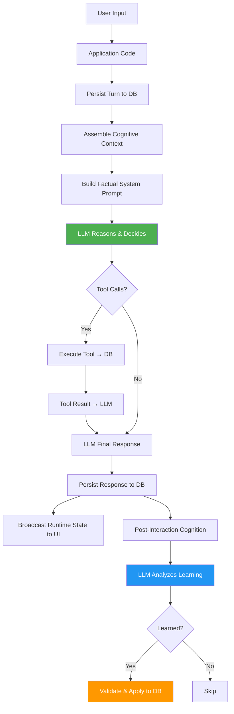

# Walkthrough: Cognitive Control Flow Rebuild

## Summary

Replaced Madhurita's deterministic, prompt-driven architecture with a single cognitive decision pipeline where **application code provides facts**, **the LLM reasons and decides**, **tools execute**, **the database persists**, and **UI reflects authoritative state**.

## Files Changed

### [cognition-2.ts](file:///Users/ankitsingh/Madhurita/She-is-still-alive./server/cognition-2.ts) — Core Cognitive Engine

**Removed:**
- `evaluateProactiveState()` — the hard-coded IF/ELSE priority ladder (Guest→110, Notes→100, Events→90, Owner→80, Task→70) that **decided** whether to speak
- `buildReasoningPromptFromContext()` — the massive prompt that mixed behavioral directives (`UNKNOWN / GUEST BOOT BEHAVIOR`, `OPERATIONAL BRIEFING GUIDANCE`, `PERSONA & VOICE CONVERSATIONAL PROFILE`) with factual state
- `extractKnowledgeProgrammatically()` — 150 lines of regex-based learning (`/i like|love|prefer/`, `/my goal is/`, `/every day|usually|always/`) that created noise in the database
- `extractHeuristics()` — wrapper around the regex engine
- `detectAndApplyUserDirectives()` call from `processChatTurn()` — removed from the main chat pipeline

**Added:**
- `buildStartupFacts(ctx)` — assembles pure factual startup context (identity, time, pending messages, tasks, visitors) for the LLM to reason over. Returns `null` for short absences with nothing new.
- `runPostInteractionCognition()` — LLM-driven semantic analysis that receives the exchange + existing knowledge and returns structured JSON decisions about what to learn, correct, update, strengthen, or retire
- `applyPostInteractionDecisions()` — validates and executes the LLM's structured learning decisions through existing DB methods
- Rebuilt `buildReasoningPromptFromContext()` with three clear sections:
  1. **SYSTEM INVARIANTS** — non-negotiable rules (feminine identity, creator identity, authentication, privacy, tool verification, database truth)
  2. **COGNITIVE REASONING** — instructions for the LLM to understand, connect, reason, decide, act, respond
  3. **APPLICATION STATE** — pure factual data (identity, time, messages, tasks, memories, patterns, conversations)
- Memory/pattern IDs now included in the system prompt so the LLM can reference them for corrections

**Restructured:**
- `evaluateProactiveState()` now delegates to `buildStartupFacts()` for fact assembly. The structured result is preserved for backward compatibility but no longer makes deterministic behavioral decisions.
- `analyzeAndLearn()` now calls `runPostInteractionCognition()` (LLM-driven) instead of `extractKnowledgeProgrammatically()` (regex-driven)

---

### [live-session.ts](file:///Users/ankitsingh/Madhurita/She-is-still-alive./server/live-session.ts) — Live Voice Session Manager

**Removed:**
- All `[SYSTEM TRIGGER: ...]` message injection — the fake conversation turns that forced the LLM to speak
- `detectAndApplyUserDirectives()` — the duplicate regex engine for voice/language/style detection (56 lines of regex)
- Voice name regex (`callirrhoe`, `aoede`, `kore`, `leda`, `despina`)
- Language directive regex (`speak in hindi`, `english me bolo`, etc.)
- Response length regex (`keep responses short`, `detailed response`, etc.)
- Speaking style regex (`speak casually`, `be warm`, etc.)
- `VALID_FEMALE_VOICES` import (no longer needed)

**Added:**
- `detectAndApplyAddressingDirective()` — slim method that only handles addressing title detection (`mujhe Boss bulana`, `call me Sir`). This is the only deterministic fast-path kept.
- Factual startup context delivery via `cognition.buildStartupFacts()` instead of `[SYSTEM TRIGGER]`

---

### [db.ts](file:///Users/ankitsingh/Madhurita/She-is-still-alive./server/db.ts) — Database Layer

**Added:**
- `updatePatternDescription(identityId, patternId, newDescription, newCategory?)` — for LLM-driven pattern correction/evolution
- `weakenPattern(identityId, patternId, amount)` — reduces confidence; auto-deletes below 0.15 threshold
- `updateMemoryContent(identityId, memoryId, newContent, newCategory?)` — for LLM-driven memory correction/evolution

---

## What Was NOT Changed

- [auth.ts](file:///Users/ankitsingh/Madhurita/She-is-still-alive./server/auth.ts) — Authentication is deterministic and correct
- [runtime-state.ts](file:///Users/ankitsingh/Madhurita/She-is-still-alive./server/runtime-state.ts) — Authoritative state builder, unchanged
- [tools.ts](file:///Users/ankitsingh/Madhurita/She-is-still-alive./server/tools.ts) — Tool definitions and execution, unchanged
- [server.ts](file:///Users/ankitsingh/Madhurita/She-is-still-alive./server.ts) — API endpoints, unchanged
- All frontend components — UI is a projection of backend state

---

## Verification Results

| # | Condition | Status |
|---|-----------|--------|
| 1 | No `[SYSTEM TRIGGER]` strings in code | ✅ Zero results (only in a comment explaining removal) |
| 2 | No `BOOT BEHAVIOR` directives in system prompt | ✅ Zero results |
| 3 | `extractKnowledgeProgrammatically()` not on main path | ✅ Zero references anywhere |
| 4 | No duplicate `detectAndApplyUserDirectives()` | ✅ Single source in cognition-2.ts; live-session.ts uses `detectAndApplyAddressingDirective()` |
| 5 | Build succeeds | ✅ Zero TypeScript errors in changed files |
| 6 | System prompt separates facts from behavior | ✅ Three clear sections: INVARIANTS, COGNITIVE REASONING, STATE |
| 7 | LLM-driven learning replaces regex | ✅ `runPostInteractionCognition()` uses structured JSON |
| 8 | Guest privacy isolation preserved | ✅ Guard in `analyzeAndLearn()` blocks guest learning |
| 9 | Startup context is factual, not behavioral | ✅ `buildStartupFacts()` returns bullet-point facts |
| 10 | Database is single source of truth | ✅ All learning decisions validated through DB methods |

## Architecture After Rebuild

